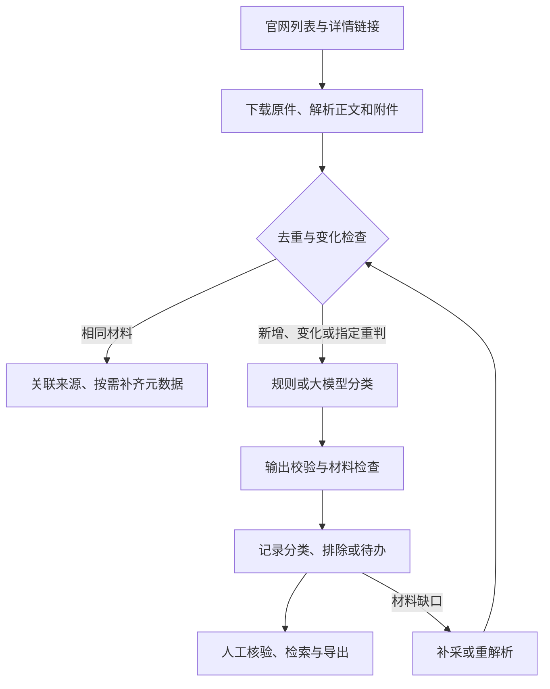

# 投资项目政策归集系统

面向发改条线投资政策研究，将政府官网分散发布的政策文件归集为可检索、可分类、可核验的政策资料库，支持项目谋划、政策对标与研究参考。

**交付定位：已形成可演示、可小范围试用的业务原型，尚未完成正式生产验收。** 当前重点应放在少量正确性问题收尾、独立业务验收和演示准备，不宜继续堆叠功能。

本说明核对日期为 **2026-09-14**，代码基线为 [99f0afb](https://github.com/deyye/policy-collector/commit/99f0afbf1b820d6543c20b7c4106ec38b20c6949)，分支为 `feat/scope-criteria-and-acceptance`。本次通过仓库代码及留存记录核对，执行环境不可用，**没有重新运行 Python 测试、真实官网采集或浏览器验收**。以下测试成绩均注明证据及适用版本，不能沿用其他分支的测试数。

## 1. 汇报要点：解决什么问题、取得什么成果

传统政策整理的工作量不仅在下载，还在于判断“该不该收”、提取完整材料、区分转载与变化，以及处理模糊结论。本系统围绕两个核心建设：

1. **可维护的业务判断口径。** 区分政策正文与信息发布，判断条款是否实质作用于投资项目，再按四类归并；同一口径供规则与模型参考。
2. **可追溯的采集工程。** 适配政府官网不同列表机制，保存网页及附件原件，提取元数据，以版本、来源和复核记录串起完整处理链条。

| 已有成果 | 当前实现 | 汇报边界 |
|---|---|---|
| 政策采集链路 | 发现链接、下载、解析、分类、去重、入库、复核、导出 | 已有多个官网历史实采记录；不代表全国覆盖 |
| 标准化归集 | 标题、正文、发布日期、成文日期、文号、发文机关、来源、附件及分类 | 原文没有的信息留空，不猜测补齐 |
| 规则与模型双轨 | 无 API 可用规则；有服务时由模型读取正文与附件、分段判断 | 规则可运行不等于语义判断准确 |
| 四类多标签 | 引导、准入、保障、激励约束，可同时归多类 | 尚无独立、经过验收的主类判定字段 |
| 数据留痕 | 原件指纹、来源关联、采集版本、分类理由、人工复核历史 | 采集版本不等于政策法律修订或有效性 |
| 待办分流 | 材料、口径、结论、故障分别展示 | 分流不代表所有问题已自动解决，见第8节 |
| 材料修复 | 缓存重解析、失败补采、旧格式转换、永久死链识别 | 复杂扫描件、图形 OFD 等仍有缺口 |
| 评测工具 | 回归测试、业务边界样例、分层抽样、模型对比、双轮采集检查 | 程序测试与业务准确率分别验收 |

可用于汇报的概括：**已构建从官网采集到政策分类、资料留存和人工核验的完整原型；大模型负责语义研判，程序负责可重复的执行和质量检查，业务人员处理口径与疑难结论。下一阶段以提高归集可信度和减少人工核验工作量为重点。**

## 2. 设计思路与业务口径

### 2.1 先判断是否收录，再判断政策作用

顶层判据：文件是否对固定资产投资项目的形成、决策、审批、建设、要素保障、资金支持、监管或评价，提供普遍适用的规则、要求或支持。

- 范围内政策性文件不限于法律意义上的“行政规范性文件”；实施意见、工作方案、专项规划等也可能收录。
- 不要求整篇以投资为主；有实质项目条款即可，但仅引用他文、否定语境或泛泛提及项目不能直接视为支持依据。
- 单个项目批复、政策解读、会议通知、人事信息、采购结果等通常排除；“会议制度”等真正的制度文件应区别处理。
- 按本任务已记录的业务边界，纯存量企业运行端电价政策暂不纳入。混合文件如果直接规定项目建设或准入条件，仍需核对条款。
- 规则用强表述、项目生命周期表述、弱词及标题辅助判断；它是语义判据的近似实现，仍可能误收或漏收。

当前配置依据见 [classification.yaml](config/classification.yaml)。其中记录了2026-09-11业务沟通口径。历史 [边界讨论清单](docs/BOUNDARIES-v0.6.md) 保留当时的待确认状态，不应将其整份继续视为当前未决口径；残余争议应按具体条款继续确认。

| 类别代码 | 类别 | 回答的问题 | 典型内容 |
|---|---|---|---|
| `guide` | 引导类 | 往哪投 | 发展规划、产业导向、区域布局 |
| `access` | 准入类 | 让不让投 | 审批、核准、备案、环评、节能审查 |
| `guarantee` | 保障类 | 靠什么投 | 土地、资金、信贷、能耗、人才要素 |
| `incentive` | 激励约束类 | 投了怎样 | 奖补、优惠、价格支持、全过程监管、绩效及后评价 |

分类依据应落到条款实际作用。同一文件给予土地支持又规定奖补及绩效要求，可以归多类；不能把某个标签排在第一位就当作已经验证的“主类”。

### 2.2 技术流程



采用 Python、Flask、SQLite 与配置文件，方便本地部署和展示，避免为了原型引入额外服务。采集适配与分类分开，新增官网不必重写判断逻辑；业务口径调整也不必重写爬虫。

- 列表：支持静态 HTML、内嵌 recordset/CDATA、中国政府网公开 JSON、浙江 unitbuild 动态接口和部分 TRS 翻页。
- 材料：正文与附件解析文本共同参与分类；原件保留 SHA-256 指纹，便于追溯和重解析。
- 去重：同文号与内容指纹辅助识别转载；同来源正文或附件变化产生采集快照，保留历史人工结论。
- 校验：检查 JSON 字段、类别、相关性、置信度及证据文本。当前采用原文匹配与字符片段覆盖检查；证据可匹配不等于结论正确，改写引用仍须核验。
- 效率：限制每批文件数、请求间隔、重试次数、文件大小和模型分段数量；相同材料复用结果，材料修复可使用本地原件。当前没有生产吞吐或净节省工时的实测结论。

### 2.3 如何理解这里的 Agent

当前实现是**任务驱动、状态分流、可修复的工作流**：程序收集材料，模型进行语义判断，程序校验结果，再依据状态决定继续入库、等待修复或交人处理。

| 状态 | 含义 | 谁处理 |
|---|---|---|
| `none` | 当前无需接管 | 程序记录结果；仍应抽检 |
| `material` | 材料缺失或未解析 | 运维触发补采/重解析，无法恢复时人工处理 |
| `scope` | 业务范围需要裁决 | 业务负责人；当前有状态定义与展示，自动触发覆盖仍需完善 |
| `review` | 结论或依据需确认 | 业务人员查看原文后采纳、改判或剔除 |
| `system` | 模型配置或调用等故障 | 运维检查接口、配置和运行记录 |

**本分支没有让 LLM 自主选择采集工具的规划器，也没有逐文件 Agent 时间线。** 补采通过命令触发，定期采集需要单独启动调度进程。将材料分流到“机器处理”不意味着机器已经后台自修。

没有 API 时，建议显式选择 `--prefer rule` 演示。若选择 `llm` 但服务不可用，会回退规则并记录 `rule_fallback`、故障原因和系统待办，不冒充模型成功。

## 3. 来源覆盖与材料能力

当前共配置 **9个启用的真实来源、1个停用的合成演示来源**。国家层面3个来源，浙江1个，其他省级来源5个。

| 来源配置名 | 范围 | 当前限制 |
|---|---|---|
| `ndrc_zcwj`、`ndrc_ghxwj` | 国家发改委政策文件、规范性文件栏目 | 配置发现上限各2页；需持续检查附件和栏目变化 |
| `gov_latest` | 中国政府网最新政策 | 公开 JSON 数据范围，不等于全部历史政策 |
| `zjfgw_gsgg` | 浙江发改行政规范性文件 | unitbuild 逐页发现，上限40页，空页停止 |
| `jsfgw_tzgg` | 江苏发改通知公告 | 首页；混有价格、招聘等噪音，历史翻页待接 |
| `cq_normative` | 重庆发改规范性文件 | 当前列表页 |
| `fj_normative` | 福建发改规范性文件 | 当前列表页，历史翻页待接 |
| `sx_normative` | 陕西发改规范性文件 | 当前列表页，历史翻页待接 |
| `hn_local_rules` | 湖南发改地方性法规规章 | 当前列表页，历史翻页待接 |

`max_pages` 是配置上限，只有适配器真正支持翻页才有意义。`--limit` 是每个来源本批最多处理的候选数量，不能据此宣称采全。

| 格式 | 当前能力 |
|---|---|
| HTML、DOCX | 正文、元数据及 DOCX 表格文本提取 |
| 文本 PDF | 逐页提取与完整性检查 |
| 扫描 PDF | 可选本地 OCR，依赖 Poppler、Tesseract 与中文语言包；结果需核验 |
| 文本 OFD | 提取文本；图形、模板型复杂材料仍有限制 |
| 旧 DOC/WPS | 优先 LibreOffice；macOS 可回退 textutil，转换完整性需核验 |
| XLSX | 已有工作表文本提取能力，复杂公式、布局与语义关系仍需检查 |
| 其他格式 | 保留原件和失败/未解析状态，不冒充完整阅读 |

默认单文件下载上限20MB；PDF页数上限500页；OCR默认最多20页，可通过 `POLICY_OCR_MAX_PAGES` 调整，语言默认 `chi_sim+eng`。只有 Python 依赖不会自动安装转换/OCR工具。

404/410等永久死链与临时失败分开处理：有其他可用材料时可以继续判定并记明缺件；不能把“按现有材料判定”解释成“材料已齐全”。完全无材料时不能仅凭标题完成判断。

## 4. 测试结果与证据

### 4.1 验证台账

| 验证项目 | 留存结果 | 证据与适用范围 |
|---|---|---|
| 当前基线回归 | 提交记录写明 **62 passed**，含死链放行、503仍阻断等测试 | [99f0afb提交记录](https://github.com/deyye/policy-collector/commit/99f0afbf1b820d6543c20b7c4106ec38b20c6949)；本次未复跑，不能视为本次独立验证 |
| 前序质量回归 | **60项通过**；覆盖重解析、人工结论保护、附件版本、抽样指纹和预检 | [v0.6记录](docs/REVIEW-v0.6.md)，属于历史版本 |
| 当前业务边界集 | **14例：正6、负8**，包含否定、引用、纯运行电价等 | [样本文件](validation/acceptance_cases.json)；是开发边界集，不是独立终审验收集；本次未运行 |
| 浙江列表发现 | 历史验证 **387条链接、27页**，末页为空 | [历史验证](VALIDATION.md)，不等于387份完整政策已入库 |
| 官网小批量采集 | 国家、中国政府网、重庆及浙江/江苏/福建/陕西/湖南有历史采集记录 | [原始批次统计](docs/validation_summary.json)、[v0.4记录](docs/VALIDATION-v0.4.md)；部分批次为partial |
| 材料修复 | 历史4附件小库中，完整解析由1个增至2个 | [v0.6记录](docs/REVIEW-v0.6.md)，不能外推至全库 |
| 最新死链修复 | 提交记录报告浙江库待补材料1→0 | [99f0afb](https://github.com/deyye/policy-collector/commit/99f0afbf1b820d6543c20b7c4106ec38b20c6949)；当前未取得该运行库独立复核 |
| 本轮文档核对 | 已核对分支、CLI参数、模块、配置、评测JSON及关键处理路径 | 未执行程序；查询该分支 GitHub Actions 未见运行记录 |

### 4.2 历史真实模型探索结果

仓库留存56份浙江样本的模型比较，模型字段记录为 `deepseek-v4-flash`。以下直接取自 [eval_report_v0.5.json](gold/zj_v1_20260909/eval_report_v0.5.json)，对应历史口径，**不是当前分支重新评测的结果**。

| 指标 | 历史规则基线 | 历史模型结果 |
|---|---:|---:|
| 相关性精确率 | 61.90% | 90.62% |
| 相关性召回率 | 70.27% | 78.38% |
| 相关性F1 | 65.82% | 84.06% |
| 四类标签微平均F1 | 45.16% | 60.71% |
| 整篇完全一致率 | 8.93% | 37.50% |
| 待判定 | 14/56 | 17/56 |
| 需人工复核 | 56/56 | 43/56 |

模型记录为56条完成、0失败、0回退、0输入截断；历史文字记录耗时10分49秒。**56条标签全部为AI初标、人工终审数为0**，21条存在附件不完整。90.62%是相对这些初标的正类精确率，不是整体准确率，也不包含官网漏发现和已排除文件的漏收。

这轮探索表明模型有改善语义判断的潜力，同时暴露材料、证据与类别边界问题。不能写成“准确率已达90%”或“当前已减少76.8%人工工作”；43/56恰好是当时需复核比例，净节省工时尚未测量。历史文字报告中的解释分歧以 [后续复核说明](docs/REVIEW-v0.6.md) 为补充，不将差异一概归因于评分口径。

### 4.3 如何复验

在仓库根目录、已激活虚拟环境时执行：

```bash
python -m pip install -r requirements-dev.txt
python -m pytest -q
python scripts/acceptance_check.py --prefer rule --verbose
```

回归测试验证程序行为；14例边界集检查规则的已知误收、漏收和待复核表现。当前验收脚本仅在“静默误收”存在时返回1；**退出码0仍不保证没有漏收**。其中“需人工介入率”还把已知误收和漏收计入，不等于实际人工队列占比。应阅读分项结果，后续完善门禁。

独立业务验收应从完整材料重新取样、由业务人员终审，并将开发集与验收集分开：

```bash
python scripts/quality_tasks.py sample --limit 20 --out data/audit-new
python scripts/validate_batch.py --sample-dir data/audit-new --out-dir data/batch-preflight --dry-run
```

可加 `--reference-list data/reference.jsonl` 对照人工独立取得的官网列表，每行含 `page_url`、`title`、`source_name`、`list_url`。省略独立列表就不能检验列表漏发现。按脚本要求填写终审标签后再评分和调用真实模型；使用新的输出目录，避免覆盖冻结样本。完整步骤见 [历史质量操作说明](docs/REVIEW-v0.6.md) 及各脚本 `--help`。

## 5. 每个目录和模块做什么

### 5.1 目录导航

| 路径 | 用途 |
|---|---|
| `policy_collector/` | 应用核心：采集、解析、分类、数据库、调度、CLI和Web |
| `policy_collector/templates/` | Jinja页面：首页、政策列表/详情、来源、运行、材料质量、模型设置及公共组件 |
| `policy_collector/static/` | 页面样式，目前为 `style.css` |
| `config/` | 运行参数、官网来源、业务分类口径，分别为三个YAML文件 |
| `scripts/` | 手动验证、来源探测、材料修复、抽样与模型评测工具 |
| `tests/` | 自动回归测试；`conftest.py` 提供测试配置与隔离环境 |
| `samples/policies/` | 合成政策与反例，供离线demo使用 |
| `samples/gov/`、`samples/zj/`、`samples/jiangsu/` | 官网结构样例，验证列表与详情适配；不代表实时官网状态 |
| `samples/list.html` | 本地样例列表入口 |
| `validation/` | 业务边界样本 `acceptance_cases.json` |
| `gold/zj_v1_20260909/` | 56条历史样本、AI初标、预测、快照节选及评测报告，不是终审金标准 |
| `docs/` | 历史方案、质量审查、边界讨论、接入与验证记录；按日期和版本阅读 |
| `docs/ui/` | 静态界面说明与预览HTML；不是实时应用，也不保证同步最新待办页面 |
| `data/`（运行生成） | 默认SQLite数据库、下载原件、本机模型配置、日志/验证产物；不入Git |
| 根目录依赖文件 | `requirements.txt` 为运行依赖，`requirements-dev.txt` 增加pytest |
| `.env.example`、`.gitignore` | 环境配置示例及本机数据/密钥等忽略规则 |

### 5.2 核心代码职责

| 文件（位于 `policy_collector/`） | 职责 |
|---|---|
| `__init__.py`、`config.py` | 包版本；读取YAML、环境变量、本机模型配置与数据路径 |
| `models.py` | 文档、分类、附件等结构化数据对象和待办字段 |
| `collector.py` | HTTP请求、大小限制、重试限速、链接发现与来源范围约束 |
| `site_adapters.py` | 不同官网列表接口和详情页结构适配 |
| `parser.py` | 提取网页正文、标题、文号、日期、机关与附件入口 |
| `attachment_parsers.py` | PDF、OFD、XLSX、旧DOC/WPS转换与OCR等附件处理 |
| `classifier.py` | 规则判定、模型提示、分段汇总、证据校验及待办推导 |
| `llm_client.py` | OpenAI兼容JSON请求、超时重试、错误及token用量 |
| `model_settings.py` | 模型设置保存、密钥保护及最小连接检查 |
| `dedup.py` | 政策身份键、内容指纹与重复/变化识别 |
| `db.py` | SQLite表结构与迁移、查询、版本、来源关联、审核历史和统计 |
| `pipeline.py` | 串联采集至入库、增量检查、重判及批次结果 |
| `quality.py` | 材料完整性报告、补采候选选择、原件重解析与分类更新 |
| `sampling.py` | 分层抽样、材料冻结、开发/验收分组与人工评分 |
| `evaluation.py` | 相关性、多标签、完全一致率等评测指标 |
| `locking.py` | 采集/修复进程互斥，避免冲突写入 |
| `scheduler.py` | 按间隔循环运行启用来源 |
| `cli.py` | 命令入口：初始化、采集、查询、复核、导出、调度及Web启动 |
| `webapp.py` | 页面路由、表单校验、人工复核、采集触发和材料下载 |

主要数据表包括：`source_configs`（来源）、`fetch_records`（候选与处理状态）、`policies`（政策及版本）、`attachments`（附件）、`attachment_attempts`（附件处理尝试）、`policy_sources`（来源关联）、`review_events`（人工及处理变更）、`run_logs`（批次结果）。升级前备份数据库与原件目录；运行中的SQLite应使用backup接口生成一致快照，不只复制可能遗漏WAL的主文件。

### 5.3 脚本与测试分工

| 文件（位于 `scripts/`） | 用途 |
|---|---|
| `probe_sources.py` | 探测官网入口及列表机制，为逐站适配提供依据 |
| `zj_live_check.py` | 浙江动态列表和详情的联网验证 |
| `zj_full_ingest_check.py` | 浙江隔离库批次/双轮验证，分别检查发现、处理、材料与幂等 |
| `quality_tasks.py` | report材料报告、repair补采、sample抽样、score评分 |
| `acceptance_check.py` | 运行14例业务边界集，打印静默误收、漏收、待复核等 |
| `evaluate.py` | 已有标签与预测的指标评价 |
| `eval_llm_compare.py` | 冻结数据库快照，对比规则与模型，保存预测、指纹及用量 |
| `validate_batch.py` | 小批量模型评测，先检查材料、标签、分组和配置 |

| 文件（位于 `tests/`） | 主要覆盖 |
|---|---|
| `test_smoke.py` | 离线demo、基础页面与核心流程 |
| `test_regressions.py` | 元数据、附件、去重、模型回退、表单、边界判定等回归 |
| `test_expansion.py` | 扩展官网适配、分页、正文和元数据处理 |
| `test_quality.py` | 材料质量、评测指标与模型配置等 |
| `test_material_repair.py` | 重解析、人工结论保护、格式转换、补采与死链处理 |

## 6. 服务怎么启动

### 6.1 首次安装

使用 Python 3.10+。以下在终端执行：

```bash
git clone --branch feat/scope-criteria-and-acceptance https://github.com/deyye/policy-collector.git
cd policy-collector
python -m venv .venv
```

macOS / Linux 激活：

```bash
source .venv/bin/activate
```

Windows PowerShell 激活：

```powershell
.venv\Scripts\Activate.ps1
```

安装运行依赖：

```bash
python -m pip install -r requirements.txt
```

### 6.2 不配API，先跑离线演示

先设置独立演示数据目录，避免把合成文件混入真实政策库。macOS / Linux：

```bash
export POLICY_DATA_DIR="$PWD/data-demo"
```

Windows PowerShell：

```powershell
$env:POLICY_DATA_DIR = Join-Path (Get-Location) "data-demo"
```

随后执行：

```bash
python -m policy_collector.cli init-db
python -m policy_collector.cli demo
python -m policy_collector.cli web --host 127.0.0.1 --port 8000 --open
```

浏览器打开 [本地工作台](http://127.0.0.1:8000)。保持终端运行，Ctrl+C停止Web。端口占用时换 `--port 8001`。后续只看已有数据，直接执行最后一条命令即可。

`demo` 使用合成样例和规则，不需要网络或模型密钥；它会在所选数据库中写入样例。切换真实库时，在macOS/Linux执行 `unset POLICY_DATA_DIR`，PowerShell执行 `Remove-Item Env:POLICY_DATA_DIR`，再初始化并重启服务。默认库是 `data/policy.db`，原件在 `data/downloads/`。

### 6.3 配置模型与真实采集

网页“模型配置”可填写兼容服务地址、模型名和密钥，然后检查连接。也可命令行交互输入密钥：

```bash
python -m policy_collector.cli configure-llm --provider dashscope
python -m policy_collector.cli llm-check
python -m policy_collector.cli run --source zjfgw_gsgg --prefer llm --limit 10
```

默认YAML预置百炼兼容地址和 `qwen-plus`，不代表已经提供可用密钥，也不是历史评测所用模型。自定义服务使用 `configure-llm --provider custom --base-url 服务地址 --model 模型名`。

当前分支的客户端要求非空密钥，**尚不支持直接免密连接本地模型**。已部署的本地兼容服务如有鉴权，可按自定义服务配置；免密适配属于后续优化，不会自动下载或部署模型。

配置优先级为：非空进程环境变量 > 非空根目录 `.env` > 本机 `data/llm.local.json` > YAML。密钥不回显，本机文件不加密且不入Git；演示或分享数据目录时不要带出密钥。用 `doctor` 检查配置，`llm-check` 才会发出最小模型请求并产生少量用量。

没有模型也可联网采集：

```bash
python -m policy_collector.cli run --source zjfgw_gsgg --prefer rule --limit 10
```

规则模式存在已知误收边界，不能将其自动确认结果直接用作正式归集结论。模型恢复后，显式重判未人工确认记录：

```bash
python -m policy_collector.cli run --source zjfgw_gsgg --prefer llm --reclassify --limit 20
```

### 6.4 定期采集、补材料与导出

Web与调度是两个独立进程。另开终端、激活同一环境并使用同一数据目录：

```bash
python -m policy_collector.cli schedule --source zjfgw_gsgg,ndrc_ghxwj,gov_latest --interval 60 --limit 20
```

调度先运行首轮，再于每轮结束后等待60分钟；终端需要持续运行。可加 `--cycles 2` 做双轮观察。`web` 不会自动启动调度；当前未交付常驻服务或Docker编排。

```bash
# 失败文件补采
python -m policy_collector.cli run --source zjfgw_gsgg --retry-only --limit 10

# 质量报告与材料修复；输出路径每次使用新名字
python scripts/quality_tasks.py report --out data/quality-before.json
python scripts/quality_tasks.py repair --local-only --prefer rule --limit 10 --out data/repair-local.json
python scripts/quality_tasks.py repair --prefer llm --limit 10 --out data/repair-online.json
python scripts/quality_tasks.py report --out data/quality-after.json

# 导出人工确认项；adjusted为人工改判后采纳的另一组
python -m policy_collector.cli export --format csv --review confirmed --out data/confirmed.csv
python -m policy_collector.cli export --format json --review adjusted --out data/adjusted.json
```

默认查询/导出包括当前版本的待办候选，不能把默认导出当作已确认政策清单。运行出现 `partial` 时查看附件、正文和模型回退计数；命令完成不表示材料完整。

当前Web是本地开发服务，未实现用户登录、角色权限和生产服务治理。汇报用默认回环地址即可；正式多人使用应再补鉴权、生产进程管理和备份恢复验证。

## 7. 汇报演示顺序（约5分钟）

1. **业务目标与口径（1分钟）**：解释为何不仅是爬虫，展示四类分类与“部分条款涉及即可、纯运行端政策排除”的任务边界。
2. **来源与数据（1分钟）**：展示实际配置的国家/浙江/外省来源，区分来源已配置、链接已发现、正文已处理与材料完整。
3. **一份完整政策（1分钟）**：打开真实文件，查看文号、日期、正文、附件、分类理由、来源与版本。
4. **一份待办文件（1分钟）**：展示为什么要人处理或补材料，查看原文并演示复核留痕。当前待办清除存在第8节问题，不承诺复核后计数立即归零。
5. **成果与下一步（1分钟）**：引用第4节有证据的历史结果，说明独立业务验收、少量正确性修复和重点来源补齐计划。

离线样例用于兜底展示，明确标记为合成数据；真实采集和模型评测使用事先准备的记录。不要现场以长时间全量采集或临时API成功作为演示成立的前提。

## 8. 还值得优化什么

本轮仅整理文档和进行静态核对，**下列代码问题尚未修复，也未新做运行复现**。前两项影响业务闭环，应优先于进一步美化或扩省。

| 优先级 | 当前发现 | 建议与完成标准 |
|---|---|---|
| 优先收尾 | `db.audit()` 清除 `need_review`，但未同步更新 `todo_type`；首页与列表按后者统计/筛选 | 确认、改判、剔除后结论待办正确消失；独立材料问题继续保留，补状态一致性回归 |
| 优先收尾 | LLM允许“不收但需复核”；`pipeline._ingest_url()` 新文件路径遇 `no` 直接排除 | 有复核要求的负结论进入可见队列；明确无需复核的负结论才排除，补低置信度/缺证据负例测试 |
| 优先收尾 | 边界集已注明引用他文可同时命中多个强词；运行电价排除主要看标题 | 引用、否定、混合条款不能仅凭词数自动确认；用原文条款验收，避免用同一开发集宣称泛化准确率 |
| 汇报后近期 | 运行页为13列表格和6秒刷新，没有逐文件阶段及耗时；启动按钮检查锁和获取锁之间有窗口 | 简化为当前文件、阶段、数量、异常；请求中原子占用运行锁，连点不启动多次任务 |
| 汇报后近期 | 关键词查询只覆盖标题、正文、文号，未搜索附件解析文本 | 附件命中返回文件名和片段，验证仅存在于附件中的关键词能搜到 |
| 汇报后近期 | 材料待办不全可自修，模型恢复也需要主动重判；无本地免密支持 | 明确处理责任，增加有限自动修复/回退补判和本地服务适配，保留上限与操作记录 |
| 试用验收 | 只有历史AI初标比较，缺当前独立终审集与工时统计 | 终审完整材料，分别量误收、漏收、四类F1、需接管比例、每篇复核分钟数 |
| 按需扩展 | 多数外省只接首页；复杂附件和政策有效性仍有限制 | 先补重点省份翻页和附件，双轮验证；有效性另建明确标注流程，不从采集日期推断 |

验收脚本还应把关键漏收计入失败门禁，并将“实际待办比例”和“评测错误比例”分开。建议接入CI保存可追溯测试结果，再讨论长期稳定性、费用预算、来源告警与生产并发。

**收尾判断：主流程和汇报素材已经具备。完成上述正确性收尾并通过一次目标机器演示后，适合进入小范围业务试用；正式上线应以独立业务验收和持续运行结果为依据。**

## 9. 历史资料索引

- [v0.6质量改进与历史结果复核](docs/REVIEW-v0.6.md)
- [v0.5质量审查](docs/QUALITY-v0.5.md)
- [国家、浙江及重庆等早期验证](VALIDATION.md)
- [外省扩展验证](docs/VALIDATION-v0.4.md)
- [历史模型报告与标签](gold/zj_v1_20260909/README.md)
- [静态UI预览说明](docs/ui/README.md)

历史资料按当时版本保留。旧文中“OFD/旧Word均未支持”“口径全部待确认”等描述不能覆盖本README所核对的当前实现。
