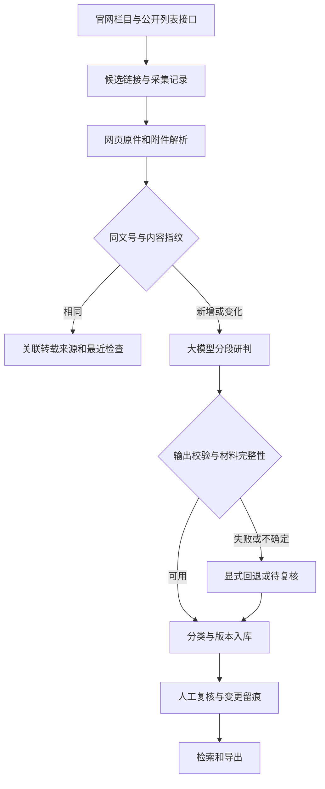

# 投资项目政策归集系统

在原版 v0.2 上完善的 v0.3：从政府官网发现文件、保存网页及附件、提取元数据，用大模型判断投资政策相关性及四类分类，经过校验后落地 SQLite，并支持复核、追溯、导出和定期更新。

**当前定位是可运行的研究验证版本。** 已有真实网页采集验证：中国政府网、国家发展改革委、重庆（规范性文件试点）、**浙江（动态列表全量翻页 387 条 + 真实入库）**、**江苏（通知公告，TRS jpage recordset 列表 + 真实入库）**；接入细节见 [接入记录](docs/EXPANSION.md)、[验证记录](docs/VALIDATION.md)。其他省份按 `scripts/probe_sources.py` 探测结果逐站适配（多数为 JS/动态构建，见 EXPANSION）。本次环境未配置真实模型密钥，真实网站验证使用规则模式，不能据此宣称大模型分类准确率。

## 1. 快速启动

Python 3.10+。在仓库根目录执行：

```bash
python -m venv .venv
# Windows PowerShell
.venv\Scripts\Activate.ps1
# macOS / Linux 改用：source .venv/bin/activate
pip install -r requirements.txt
python -m policy_collector.cli init-db
python -m policy_collector.cli demo
python -m policy_collector.cli web --open
```

打开 `http://127.0.0.1:8000`，可以查看政策、正文、附件原件、分类理由、来源关联、历史版本和运行日志，完成确认、调整分类、剔除等复核操作。界面默认为大模型分类，也可选择规则演示。

`demo` 使用明确标注的合成材料，不代表官网采集成果。建议先在单独的数据目录演示，避免与实际政策混用。PowerShell 设置 `$env:POLICY_DATA_DIR="D:\policy-demo"`；Linux 设置 `export POLICY_DATA_DIR=/path/to/policy-demo`。删除此环境变量后恢复默认的 `data/`。

## 2. 配置真实大模型

使用支持 Chat Completions 与 JSON 输出模式的兼容接口，既可配置云端服务，也可配置单位许可使用的模型服务。密钥只读环境变量或本地 `.env`，不写入配置、日志或仓库。

**推荐：复制 `.env.example` 为 `.env` 后填写**（程序启动时自动读取，不覆盖已有环境变量；`.env` 已被 gitignore）：

```bash
cp .env.example .env        # 然后编辑 LLM_API_KEY / LLM_BASE_URL / LLM_MODEL
```

`.env.example` 内注释给出示例：`LLM_BASE_URL` 留空默认 OpenAI（`https://api.openai.com/v1`）；通义百炼兼容地址 `https://dashscope.aliyuncs.com/compatible-mode/v1`、DeepSeek `https://api.deepseek.com/v1`。也可直接使用同名环境变量（PowerShell `$env:LLM_API_KEY=...`，Linux `export LLM_API_KEY=...`）。

```bash
python -m policy_collector.cli doctor     # 检查 llm_ready/model_configured/key_configured，不显示密钥
python -m policy_collector.cli run --source ndrc_ghxwj --limit 5
```

`doctor` 只显示是否配置，不显示密钥。无需也不应把密钥发进对话。

分类读取标题、文号、发文机关、正文及已解析附件，按字符分段逐段判断并汇总多标签。默认每段 10000 字符、最多 24 段；超限明确标记 `input_truncated` 并进入待复核，不宣称已读完。页眉、表格及扫描件仍需要核验。

系统检验类别白名单、相关性枚举、布尔值、置信度和引用是否出现在输入原文；引用存在只能证明可定位，不能代替语义正确性评价。模型失败或未配置时记录 `rule_fallback` 和原因，候选进入待复核，不会静默当作大模型成功。分段上限、超时与重试在 `config/config.yaml` 调整。

首次用规则模式采集后，可重新分析尚未人工确认的记录：

```bash
python -m policy_collector.cli run --source ndrc_ghxwj --reclassify --limit 20
```

人工确认、人工调整和剔除记录不会被自动重分类覆盖。模型通过使用 `confirmed_auto` 状态，表示自动校验通过，**不等于人工确认**。

## 3. 按任务划分的模块

| 模块 | 实际职责 | 主要文件 |
|---|---|---|
| 来源与列表 | 栏目白名单、详情 URL 规则、HTML/公开 JSON/unitbuild(JPaaS)/recordset(TRS jpage)/TRS 翻页 | `config/sources.yaml`、`collector.py`、`site_adapters.py` |
| 下载与解析 | 限速、重试、大小限制、网页原件、PDF/DOCX 附件、日期与文号 | `collector.py`、`parser.py` |
| 政策研判 | 是否属于投资项目政策；四类多标签；原文证据校验；回退与复核标记 | `classifier.py`、`llm_client.py` |
| 去重与入库 | 文号及内容指纹、转载来源关联、附件变化版本、事务入库 | `dedup.py`、`db.py`、`pipeline.py` |
| 周期运行 | 增量发现、轮转复查已采 URL、失败补采、进程互斥、运行日志 | `scheduler.py`、`locking.py` |
| 使用与验收 | 检索、人工复核留痕、原件下载、JSON/CSV 导出、人工标注评测 | `webapp.py`、`cli.py`、`scripts/evaluate.py` |

列表发现支持四种站点形态（`probe_sources.py` 可自动判定）：
- **html-static / recordset**：列表在静态 HTML 或 `<script>` 内嵌 XML 记录（TRS jpage，江苏模式）→ 默认 `ListPageParser`；
- **gov_json**：栏目公开 JSON 列表（中国政府网）→ `parse_gov_feed`；
- **zj_unit**：hanweb「页面构建单元」动态接口（浙江模式）→ `discover_zj_unit_links`，含逐页翻页；
- **js-render**：纯前端渲染（安徽 Epoint、江西等）→ 需按站点数据接口另行适配。



四类分别为 `guide` 引导、`access` 准入、`guarantee` 保障、`incentive` 激励约束。同一政策可包含多类，不能机械按标题归类。具体单个项目批复、新闻、解读、采购公告通常不作为政策正文归集，边界口径由业务人员核定。现有关键词模式只是基线，可能误收或漏收，所有非排除结果均待人工复核。

## 4. 来源、定期采集与补采

```bash
python -m policy_collector.cli sources
python -m policy_collector.cli run --source gov_latest --prefer rule --limit 5
python -m policy_collector.cli run --source cq_normative --prefer rule --limit 5
python -m policy_collector.cli run --source zjfgw_gsgg --limit 15
python -m policy_collector.cli run --source jsfgw_tzgg --limit 5
python -m policy_collector.cli run --source all --limit 20
python -m policy_collector.cli run --source ndrc_ghxwj --retry-only --limit 10
python -m policy_collector.cli schedule --source ndrc_ghxwj,gov_latest,cq_normative,zjfgw_gsgg,jsfgw_tzgg --interval 60 --limit 20
```

`run` 默认使用大模型，`--prefer rule` 明确选择规则基线。`schedule` 立即运行首轮，之后每轮完成后间隔指定分钟，进程需要持续运行；本次交付没有在后台替你部署常驻任务。可用 `--cycles 2` 验证两轮后退出。缺省只运行启用且非本地演示的来源，Ctrl+C 在当前工作结束后退出。服务器可使用系统定时器调用单次 `run`。

每次既发现新链接，也按最近检查时间轮转复查已有链接。`--limit` 是每来源本轮最多处理的文件数，**不是已覆盖整站**；持续大量新增/失败时旧记录复查可能推迟。`max_pages` 是发现页数上限，历史补录需扩大页数并分批运行。

失败候选留在 `fetch_records`；附件下载失败可补采。没有发现链接视为来源异常，不伪装成成功。运行状态区分 `ok / partial / failed`，CLI 分别返回 0 / 1（运行有异常或模型回退）/ 2（参数配置错误）。发现列表成功不表示所有文件或附件成功，应一起查看运行统计。

浙江 `zjfgw_gsgg` 为 hanweb「页面构建单元」动态列表：栏目页声明 unitbuild 参数 → GET JPaaS 单元接口的 `data.html`。已实现**逐页全量翻页**（paramJson pageNo/pageSize，空页自停），真实源验证 387 条/27 页（2020-01 至 2026-06），见 [接入记录](docs/EXPANSION.md)。

江苏 `jsfgw_tzgg` 为 TRS jpage 站点：列表首页由 `<script>` 内嵌 `<datastore><recordset>` XML(CDATA) 输出最新 30 条，`ListPageParser` 通用展开解析。**当前 `max_pages=1`（增量采集够用），历史翻页（dataproxy POST/XML、多单元）与「行政规范性文件」目录（JS 渲染）尚未接入**；该栏目混有价格公告/招聘公示，待复核噪音较高，投资政策使用建议改接规范性文件栏目。

停用来源不能由 `run/schedule` 执行。

## 5. 数据、去重与人工复核

SQLite 默认 `data/policy.db`，网页及附件按 SHA-256 不可变留存在 `data/downloads/<source>/`。保留原文链接与正文位置；缺失日期或文号留空，不用猜测值填充。发布日和成文日分别存储。

- 同文号、正文与附件指纹一致：不重复插入，保留转载来源。
- 同一原网址正文或附件变化：追加版本并重新待复核，保留历史版本及历史人工决定。
- 同文号但其他网址内容不同：保留独立待复核记录和关联键，不擅自认定为正式修订。
- 无文号：使用发文机关/来源与完整标题，保留年份、试行等括号内容；宁可待复核，不强行跨站合并。
- 网页版式、正文空白变化不生成新版本。纯元数据变化目前只留在抓取原件，不自动更新政策字段；网址恢复历史相同版本不会把旧版覆盖成当前版。版本号代表采集内容快照，不代表法律修订次数。

主要表：`source_configs` 来源；`fetch_records` 发现和下载状态及分类快照；`policies` 政策内容与版本；`attachments` 附件与解析结果；`policy_sources` 转载来源；`review_events` 复核前后快照；`run_logs` 运行结果。旧库启动时补充字段和表，升级前请备份数据库及下载目录。

```bash
python -m policy_collector.cli query --review pending
python -m policy_collector.cli audit --id 1 --action adjust --category guarantee,incentive --note "已核对资金支持和绩效条款"
python -m policy_collector.cli export --format json --out data/policies.json
python -m policy_collector.cli export --format csv --out data/policies.csv
```

默认查询、导出仅含当前版本并排除已剔除项；待复核项仍包含在候选库中。正式使用前可分别按 `--review confirmed`、`--review adjusted` 导出人工通过项。JSON/CSV 均含正文、附件和来源信息，CSV 对公式起始字符进行转义。

PDF 文本和 DOCX（含表格）可以解析；扫描 PDF 标记需 OCR。OFD、旧 DOC、XLS/XLSX、压缩包等当前保留原件、标记尚未解析；不把它们当成完整阅读。默认每文件最大 20MB，PDF 最多 500 页，可根据运行环境审慎调整。附件解析缺失时进入待复核。

## 6. 测试、效果评价与交付边界

```bash
pip install -r requirements-dev.txt
python -m pytest -q
```

回归测试 **22 项**全部通过。覆盖全文及附件输入、JSON 验证、年度文号区别、转载、版本变化、失败刷新、旧库迁移、事务回滚、定时来源筛选、网页复核和来源过滤，以及浙江 unitbuild 参数提取/元数据表/全量翻页、江苏 recordset 列表与 TRS_Editor 详情、Web 表单令牌等。浙江与江苏均有离线快照样本（`samples/zj/`、`samples/jiangsu/`）不依赖网络。模拟模型只能验证接口与流程，不能验证模型理解能力。

站点探测与接入流程（扩展新省份）：

```bash
python scripts/probe_sources.py https://某省发改委首页   # 判定列表机制与建议配置
python scripts/zj_live_check.py                          # 浙江动态列表全量翻页只读验证
```

新增省份的已知现状与探测结论见 [接入记录](docs/EXPANSION.md)（安徽/江西为 JS 渲染待适配、陕西疑似反爬、多省域名待人工核实）。

业务人员独立标注真实样本，每行一个 JSON，示例结构为：

```json
{"id": 1, "relevant": true, "categories": ["guarantee", "incentive"]}
```

这只是格式示例，**不是对数据库 ID 1 的实际标注**。使用覆盖四类、非相关与边界材料的人工标注集执行：

```bash
python scripts/evaluate.py --db data/policy.db --gold gold.jsonl
```

输出相关性精确率/召回率、类别微平均指标、整篇完全一致率，以及 pending、模型回退数量。该脚本只评价已入库且标注的候选，不能衡量网站发现召回率；应另外抽查官网栏目是否漏采，并查看被排除的 `fetch_records.classification_json`。业务验收还需记录关键字段准确率、附件成功率和每篇人工核验耗时。

**尚需完成的验收：** 配置可用模型并做真实盲测（本轮按要求未开展评测）；浙江 387 条全量正文入库与双轮连续性运行；江苏历史翻页与规范性文件栏目；安徽/江西等省份的数据接口适配；按实际样本决定是否接入 OCR/OFD/旧 Word。未完成这些工作前，不应汇报为已实现全国覆盖或可无人审核直接用于正式政策适用判断。
