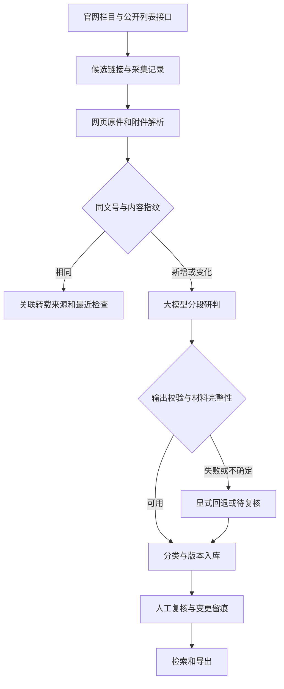

# 投资项目政策归集系统

## v0.6：材料补齐与可核验的质量闭环

基于 `efe3225` 的真实模型测试记录继续改进。新增**材料质量页、原件补采与重解析、人工结论保护、漏收分层抽样、小批量模型预检**。业务口径、原始 56 条标签和模型服务配置均保留；完整说明见 [v0.6 质量改进记录](docs/REVIEW-v0.6.md)，需指导员确认的内容见 [分类边界清单](docs/BOUNDARIES-v0.6.md)。

真实测试结果仍属 AI 初标下的探索比较：56 条中 21 条附件不完整，43 条需复核；17 条 pending 涉及 11 条证据定位失败、8 条材料不全（重叠 2 条）。后续优先补材料、定位证据和确定业务口径，不直接靠强制二选一消除 pending。

### 查看与补齐材料

启动 Web 后打开“材料质量”（`/quality`），分别查看下载成功、程序判定完整解析、格式分布和每篇材料的缺口。详情页展示解析方式、页数和最新失败尝试。统计仅针对本库当前版本，不将历史验证库混加。

```bash
# 输出路径必须是新路径；可用 --source 限定来源
python scripts/quality_tasks.py report --out data/quality-before.json
# 先使用已下载原件验证；不发起附件下载。rule 仅用于离线流程验证
python scripts/quality_tasks.py repair --local-only --prefer rule --limit 10 --out data/repair-local.json
# 补下载缺失附件，并对非人工审核的变更材料按需重新分类
python scripts/quality_tasks.py repair --prefer llm --limit 10 --out data/repair-online.json
python scripts/quality_tasks.py report --out data/quality-after.json
```

修复通过已有采集互斥与事务执行；同一原件更新解析结果，真实附件字节变化仍追加版本。人工确认、调整、剔除不会被重分类覆盖；新增材料另标“需复核”。缺少网页原件时提示常规重采，缺失附件可补下载。`attachments_cached` 表示缓存复用，不能当作新网络下载量。

文本 OFD 可直接提取；图形/模板型 OFD 仍提示人工核验，不承诺完整解析。旧 DOC/WPS 需安装 LibreOffice。扫描 PDF 可选用 Poppler、Tesseract 和对应语言包（中文须 `chi_sim`）；可通过 `POLICY_OCR_LANG` 与 `POLICY_OCR_MAX_PAGES` 控制语言和单文件 OCR 页数上限，默认 `chi_sim+eng`、20 页。OCR 成果保留人工核验提示，缺工具不会伪装解析成功。转换和 OCR 在本机执行。

### 漏收抽样与小批量验证

```bash
# reference-list 是人工独立取得的官网详情链接，可省略；省略后不能验证列表漏发现
python scripts/quality_tasks.py sample --limit 20 --reference-list data/reference.jsonl --out data/audit-v06
# 业务人员填写 sample.jsonl 的标签、复核人和日期后再评分
python scripts/quality_tasks.py score --labels data/audit-v06/sample.jsonl --out data/audit-score.json
# 先检查材料、分组、标签、上下文上限和真实模型配置
python scripts/validate_batch.py --sample-dir data/audit-v06 --out-dir data/batch-preflight --dry-run
# 有完整材料和终审标签后，使用已配置的真实模型（会产生 API 用量）
python scripts/validate_batch.py --sample-dir data/audit-v06 --out-dir data/batch-development --split development --limit 8
```

独立列表每行格式为 `{"page_url":"https://官网/详情页","title":"文件标题","source_name":"来源配置名","list_url":"官网列表页"}`。取样包含采集队列、已排除记录，以及本轮开始留存的列表过滤记录；列表适配器从未提取出的链接仍需独立名单发现。

样本目录包含 `sample.jsonl`、完整材料 `corpus.jsonl` 和冻结清单 `manifest.json`。只填写 `relevant`（布尔值）、`categories`（四类代码列表）、`label_status=human_reviewed`、`reviewer`、`reviewed_at`、`note`；不要删样本或改材料、分组。无文号时按规范化标题保守分组，仍需在验收前人工检查转载/修订关系。

`--sample-ids ID1 ID2` 可显式选择当前组的完整材料，结果只代表所选样本；不允许将开发样本临时改为验收。开发组可加 `--allow-provisional` 做无终审标签的探索调用，但不会输出验收准确率；`--split holdout` 必须全部业务终审。材料不完整或超长会阻断，避免以截断输入冒充完整材料。连续三次服务失败停止后续调用并保存已有结果。

可选 `--input-rate`、`--output-rate` 为人民币每百万 token 单价；未知单价或未完整返回 usage 时费用为未知。报告包含错误类型、待复核比例、耗时和 token；未提供新价格时不猜测费用。本轮真实缓存验证是 4 个附件中完整解析由 1 个增至 2 个；未重跑浙江 387 条全量采集，未产生新的付费模型评测结果。

## v0.5 历史说明

v0.5 基于 `improve/policy-ingestion` 上的 `bbef2ab` 更新，保留 v0.4 的省份来源、模型配置和你的 56 条浙江样本。重点修复 **LLM 输入一致性、评测可信度和全量验证误报通过**。变更说明见 [v0.5 质量审查记录](docs/QUALITY-v0.5.md)。

- 采集 → 正文及附件 → 分类 → 入库保持原流程，新增统一的材料完整性检查；直接调用分类器和评测脚本也遵循相同规则。
- 规则与 LLM 对比使用同一份完整正文及已解析附件；SQLite 使用 backup 生成只读评测快照，不复制遗漏 WAL 的主文件、不删除原库。
- 56 条样本保留原分类，增加来源网址、内容指纹与 `ai_draft` 状态；未终审标签只能做探索性比较，不能称作人工验收成绩。
- 浙江双轮检查不再自动删除目录，分别报告列表是否到底、候选是否处理完、材料是否完整、稳定输入是否幂等。

当前仍配置国家层面与浙江、江苏、重庆、福建、陕西、湖南的 9 个启用来源。已知历史覆盖和附件限制见下文及 [v0.4 官网验证记录](docs/VALIDATION-v0.4.md)。本轮完成程序回归和样本结构检查，未调用真实付费模型、未重跑 387 条全量采集。

## 界面改版：投资政策研究工作台

在 v0.5 基础上，六个前端页面统一为深蓝导航、白底工作区和克制红色标识的国企业务工作台风格。首页突出政策分类、入库和待复核；详情页以正文阅读和分类依据为中心，采集、运行和模型配置采用统一布局。

**[下载静态视觉预览](docs/ui/preview.html)** 后用浏览器打开，可切换六个页面、缩小窗口查看布局。预览使用合成演示数据，筛选和提交不可操作；实际系统通过 `python -m policy_collector.cli web --open` 启动。详细变更与验证边界见 [界面改版说明](docs/ui/README.md)。

本轮现有 47 项测试及页面访问检查通过；受预览浏览器访问限制，尚未完成真实浏览器视觉与移动端交互验收。

## 1. 快速启动

Python 3.10+。在仓库根目录执行：

```bash
python -m venv .venv
# Windows PowerShell
.venv\Scripts\Activate.ps1
# macOS / Linux 改用：source .venv/bin/activate
pip install -r requirements.txt
python -m policy_collector.cli init-db
python -m policy_collector.cli demo
python -m policy_collector.cli web --open
```

打开 `http://127.0.0.1:8000`，可以查看政策、正文、附件原件、分类理由、来源关联、历史版本和运行日志，完成确认、调整分类、剔除等复核操作。界面默认为大模型分类，也可选择规则演示。

`demo` 使用明确标注的合成材料，不代表官网采集成果。建议先在单独的数据目录演示，避免与实际政策混用。PowerShell 设置 `$env:POLICY_DATA_DIR="D:\policy-demo"`；Linux 设置 `export POLICY_DATA_DIR=/path/to/policy-demo`。删除此环境变量后恢复默认的 `data/`。

## 2. 配置真实大模型

支持 Chat Completions 与 JSON 输出模式的兼容接口，可使用云端服务或单位许可的模型服务。

**方式一：网页配置。** 启动 Web 后打开“模型配置”，选择百炼或其他兼容服务，填写服务地址、模型名与 API Key，保存后点击“检查已保存配置的连接”。密钥不回显，保存在本机 `data/llm.local.json`（POSIX 权限 0600），数据目录不进入 Git。该文件并未加密，不应共享。更换服务地址时不能沿用旧地址的本机密钥。

**方式二：命令行配置。** 密钥通过隐藏输入读取，不作为命令参数：

```bash
python -m policy_collector.cli configure-llm --provider dashscope
python -m policy_collector.cli llm-check
# 单位兼容服务可使用 --provider custom --base-url https://实际地址/v1 --model 实际模型名
```

**方式三：沿用 .env / 环境变量。** 复制 `.env.example` 为 `.env` 后填写 `LLM_API_KEY`（或 `DASHSCOPE_API_KEY`）；地址和模型留空则使用本机配置或 YAML 默认的百炼地址、`qwen-plus`。

```bash
cp .env.example .env
python -m policy_collector.cli doctor
python -m policy_collector.cli run --source fj_normative --limit 5
```

配置优先级：非空进程环境变量 > 非空 `.env` > 本机模型配置 > YAML。空白示例项不会清空已有默认值。用环境变量更换服务地址时，本机旧服务密钥不会发往新地址，需同时配置对应服务密钥。`doctor` 只检查是否填写；`llm-check` 才发出一条最小 JSON 请求，会产生少量调用费用，连接成功不代表分类效果已经验收。

百炼预置北京兼容地址；也可填写控制台提供的业务空间完整地址。密钥须与服务地域一致，详见 [百炼官方兼容接口说明](https://help.aliyun.com/zh/model-studio/compatibility-of-openai-with-dashscope)。不要把密钥提交到仓库或发进对话。

分类读取标题、文号、发文机关、正文及已解析附件，按字符分段逐段判断并汇总多标签。默认每段 10000 字符、最多 24 段；超限明确标记 `input_truncated` 并进入待复核，不宣称已读完。页眉、表格及扫描件仍需要核验。

系统检验类别白名单、相关性枚举、布尔值、置信度和引用是否出现在输入原文；引用存在只能证明可定位，不能代替语义正确性评价。模型失败或未配置时记录 `rule_fallback` 和原因，候选进入待复核，不会静默当作大模型成功。分段上限、超时与重试在 `config/config.yaml` 调整。

首次用规则模式采集后，可重新分析尚未人工确认的记录：

```bash
python -m policy_collector.cli run --source ndrc_ghxwj --reclassify --limit 20
```

人工确认、人工调整和剔除记录不会被自动重分类覆盖。模型通过使用 `confirmed_auto` 状态，表示自动校验通过，**不等于人工确认**。

## 3. 按任务划分的模块

| 模块 | 实际职责 | 主要文件 |
|---|---|---|
| 来源与列表 | 栏目白名单、详情 URL 规则、HTML/公开 JSON/unitbuild(JPaaS)/recordset(TRS jpage)/TRS 翻页 | `config/sources.yaml`、`collector.py`、`site_adapters.py` |
| 下载与解析 | 限速、重试、大小限制、网页原件、PDF/DOCX 附件、日期与文号 | `collector.py`、`parser.py` |
| 政策研判 | 是否属于投资项目政策；四类多标签；原文证据校验；回退与复核标记 | `classifier.py`、`llm_client.py` |
| 去重与入库 | 文号及内容指纹、转载来源关联、附件变化版本、事务入库 | `dedup.py`、`db.py`、`pipeline.py` |
| 周期运行 | 增量发现、轮转复查已采 URL、失败补采、进程互斥、运行日志 | `scheduler.py`、`locking.py` |
| 使用与验收 | 检索、人工复核留痕、原件下载、JSON/CSV 导出、人工标注评测 | `webapp.py`、`cli.py`、`scripts/evaluate.py` |

列表发现支持四种站点形态（`probe_sources.py` 可自动判定）：
- **html-static / recordset**：列表在静态 HTML 或 `<script>` 内嵌 XML 记录（TRS jpage，江苏模式）→ 默认 `ListPageParser`；
- **gov_json**：栏目公开 JSON 列表（中国政府网）→ `parse_gov_feed`；
- **zj_unit**：hanweb「页面构建单元」动态接口（浙江模式）→ `discover_zj_unit_links`，含逐页翻页；
- **js-render**：纯前端渲染（安徽 Epoint、江西等）→ 需按站点数据接口另行适配。



四类分别为 `guide` 引导、`access` 准入、`guarantee` 保障、`incentive` 激励约束。同一政策可包含多类，不能机械按标题归类。具体单个项目批复、新闻、解读、采购公告通常不作为政策正文归集，边界口径由业务人员核定。现有关键词模式只是基线，可能误收或漏收，所有非排除结果均待人工复核。

## 4. 来源、定期采集与补采

```bash
python -m policy_collector.cli sources
python -m policy_collector.cli run --source gov_latest --prefer rule --limit 5
python -m policy_collector.cli run --source cq_normative --prefer rule --limit 5
python -m policy_collector.cli run --source zjfgw_gsgg --limit 15
python -m policy_collector.cli run --source jsfgw_tzgg --limit 5
python -m policy_collector.cli run --source fj_normative --limit 5
python -m policy_collector.cli run --source sx_normative --limit 5
python -m policy_collector.cli run --source hn_local_rules --limit 5
python -m policy_collector.cli run --source all --limit 20
python -m policy_collector.cli run --source ndrc_ghxwj --retry-only --limit 10
python -m policy_collector.cli schedule --source ndrc_ghxwj,gov_latest,cq_normative,zjfgw_gsgg,jsfgw_tzgg --interval 60 --limit 20
```

`run` 默认使用大模型，`--prefer rule` 明确选择规则基线。`schedule` 立即运行首轮，之后每轮完成后间隔指定分钟，进程需要持续运行；本次交付没有在后台替你部署常驻任务。可用 `--cycles 2` 验证两轮后退出。缺省只运行启用且非本地演示的来源，Ctrl+C 在当前工作结束后退出。服务器可使用系统定时器调用单次 `run`。

每次既发现新链接，也按最近检查时间轮转复查已有链接。`--limit` 是每来源本轮最多处理的文件数，**不是已覆盖整站**；持续大量新增时旧记录复查可能推迟；已检查过的失败项按检查时间轮转，不再永久优先于旧文件。`max_pages` 是发现页数上限，历史补录需扩大页数并分批运行。

失败候选留在 `fetch_records`；附件下载失败可补采。没有发现链接视为来源异常，不伪装成成功。运行状态区分 `ok / partial / failed`，CLI 分别返回 0 / 1（运行有异常或模型回退）/ 2（参数配置错误）。发现列表成功不表示所有文件或附件成功，应一起查看运行统计。`documents_incomplete` 表示正文定位或解析不完整，`attachments_unparsed` 表示附件已下载但正文未完整解析；这两类也会使运行标记为 `partial`。

浙江 `zjfgw_gsgg` 为 hanweb「页面构建单元」动态列表：栏目页声明 unitbuild 参数 → GET JPaaS 单元接口的 `data.html`。已实现**逐页全量翻页**（paramJson pageNo/pageSize，空页自停），真实源验证 387 条/27 页（2020-01 至 2026-06），见 [接入记录](docs/EXPANSION.md)。

江苏 `jsfgw_tzgg` 为 TRS jpage 站点：列表首页由 `<script>` 内嵌 `<datastore><recordset>` XML(CDATA) 输出最新 30 条，`ListPageParser` 通用展开解析。**当前 `max_pages=1`（仅覆盖首页，运行间隔内新增超过首页容量可能漏采），历史翻页（dataproxy POST/XML、多单元）与「行政规范性文件」目录（JS 渲染）尚未接入**；该栏目混有价格公告/招聘公示，待复核噪音较高，投资政策使用建议改接规范性文件栏目。

省级来源覆盖范围：

| 来源 | 栏目 | 当前发现范围 |
|---|---|---|
| `zjfgw_gsgg` 浙江 | 行政规范性文件 | 动态翻页，上限 40 页，空页停止；本轮复验前两页 30 条 |
| `jsfgw_tzgg` 江苏 | 通知公告 | 首页 30 条；有招聘、价格等非投资信息，必须筛选 |
| `cq_normative` 重庆 | 行政规范性文件 | 当前列表页；沿用既有适配 |
| `fj_normative` 福建 | 行政规范性文件库 | 当前配置可发现 15 条详情链接，未接历史翻页 |
| `sx_normative` 陕西 | 行政规范性文件 | 当前列表页 20 条，未接历史翻页 |
| `hn_local_rules` 湖南 | 地方性法规规章 | 当前列表页 20 条，未接历史翻页 |

以上数量为 2026-09-09 小批量验证时的发现结果，并非已入库的正式政策数量。浙江中途失败时，已成功页的链接仍入队，来源记录错误；重复页不再视为正常结束。其余来源的历史翻页应逐站验证后扩展，不能仅增大 `max_pages` 就声称全量。

停用来源不能由 `run/schedule` 执行。

## 5. 数据、去重与人工复核

SQLite 默认 `data/policy.db`，网页及附件按 SHA-256 不可变留存在 `data/downloads/<source>/`。保留原文链接与正文位置；缺失日期或文号留空，不用猜测值填充。发布日和成文日分别存储。

- 同文号、正文与附件指纹一致：不重复插入，保留转载来源。
- 同一原网址正文或附件变化：追加版本并重新待复核，保留历史版本及历史人工决定。
- 同文号但其他网址内容不同：保留独立待复核记录和关联键，不擅自认定为正式修订。
- 无文号：使用发文机关/来源与完整标题，保留年份、试行等括号内容；宁可待复核，不强行跨站合并。
- 网页版式、正文空白变化不生成新版本。同一来源重复内容可补齐原先为空的文号、发布日期、成文日期和发文机关，写入 `metadata_backfill` 留痕；已填值、人工分类和既有身份键保持不变；网址恢复历史相同版本不会把旧版覆盖成当前版。版本号代表采集内容快照，不代表法律修订次数。

主要表：`source_configs` 来源；`fetch_records` 发现和下载状态及分类快照；`policies` 政策内容与版本；`attachments` 附件与解析结果；`policy_sources` 转载来源；`review_events` 复核前后快照；`run_logs` 运行结果。旧库启动时补充字段和表，升级前请备份数据库及下载目录。

```bash
python -m policy_collector.cli query --review pending
python -m policy_collector.cli audit --id 1 --action adjust --category guarantee,incentive --note "已核对资金支持和绩效条款"
python -m policy_collector.cli export --format json --out data/policies.json
python -m policy_collector.cli export --format csv --out data/policies.csv
```

默认查询、导出仅含当前版本并排除已剔除项；待复核项仍包含在候选库中。正式使用前可分别按 `--review confirmed`、`--review adjusted` 导出人工通过项。JSON/CSV 均含正文、附件和来源信息，CSV 对公式起始字符进行转义。

PDF 文本和 DOCX（含表格）可以解析；**XLSX 与旧版 DOC/WPS 亦可解析（2026-09-13 新增）**——XLSX 走 `zipfile`+`lxml` 直读共享字符串，旧 DOC/WPS 优先 LibreOffice、macOS 上回退系统自带 `textutil`（`.wps` 实为 OLE 复合文档，须按 `.doc` 落盘后交给 textutil）。扫描 PDF 标记需 OCR；XLS/PPT 仍需 LibreOffice。默认每文件最大 20MB，PDF 最多 500 页，可根据运行环境审慎调整。附件解析缺失时进入待复核并标记部分完成；HTTP 200 返回的 HTML 错误页也不会当作附件下载成功。

## 6. 测试、效果评价与交付边界

```bash
pip install -r requirements-dev.txt
python -m pytest -q
```

**注意（2026-09-13 实测）**：pytest 需要一个**工作区内可写的临时目录**，且**不要复用同一个目录**——
复用会因上一次运行残留的 `pytest-of-*` 触发大量 fixture 报错（表现为"几十个 ERROR"而不是测试失败）：

```bash
D="$(mktemp -d "$PWD/.tmptest.XXXXXX")" && TMPDIR="$D" python -m pytest -q && rm -rf "$D"
```

回归测试 **91 项**全部通过。覆盖全文及附件输入、JSON 验证、年度文号区别、转载、版本变化、失败刷新、旧库迁移、事务回滚、定时来源筛选、网页复核和来源过滤，以及浙江 unitbuild 参数提取/元数据表/全量翻页、江苏 recordset 列表与 TRS_Editor 详情、批量采集的单源失败隔离、Web 表单令牌等。浙江与江苏均有离线快照样本（`samples/zj/`、`samples/jiangsu/`）不依赖网络。模拟模型只能验证接口与流程，不能验证模型理解能力。

站点探测与接入流程（扩展新省份）：

```bash
python scripts/probe_sources.py https://某省发改委首页   # 判定列表机制与建议配置
python scripts/zj_live_check.py                          # 浙江动态列表全量翻页只读验证
```

来源历史探测见 [接入记录](docs/EXPANSION.md)。陕西已在 v0.4 使用可访问的规范性文件栏目接入，旧探测失败记录不代表当前接入状态。最新小批量实测与限制见 [v0.4 验证说明](docs/VALIDATION-v0.4.md)。

v0.5 程序交付轮次只做程序回归与官网连通验证；随后已用 AI 初标样本补做一轮探索性比较（结果见 §7 末）。**人工验收用的独立标注集仍待业务人员完成**。每行一个 JSON，示例结构为：

```json
{"id": 1, "relevant": true, "categories": ["guarantee", "incentive"], "label_status": "human_reviewed"}
```

这只是格式示例，**不是对数据库 ID 1 的实际标注**。使用覆盖四类、非相关与边界材料的人工标注集执行：

```bash
python scripts/evaluate.py --db data/policy.db --gold gold.jsonl
```

输出相关性精确率/召回率/F1、类别微平均指标、整篇完全一致率，以及 pending、需人工复核、输入截断、模型回退数量。多个脚本统一使用同一指标实现；pending 不算正确的非相关判断。该脚本只评价已入库且标注的候选，不能衡量网站发现召回率；应另外抽查官网栏目是否漏采，并查看被排除的 `fetch_records.classification_json`。业务验收还需记录关键字段准确率、附件成功率和每篇人工核验耗时。

**尚需完成的验收：** 人工终审标注口径、配置模型并做独立真实盲测；按 v0.5 的严格判定复核浙江全量运行结果（旧脚本的 overall_ok 未检查所有未处理候选和附件，不作为完整验收依据）；江苏历史翻页与规范性文件栏目；安徽/江西等省份的数据接口适配；按实际样本决定是否接入 OCR/OFD/旧 Word。未完成这些工作前，不应汇报为已实现全国覆盖或可无人审核直接用于正式政策适用判断。

## 7. v0.5：先预检，再比较，再人工验收

先使用**原标注采样库**预检，无需 API Key，也不会调用模型：

```bash
python scripts/eval_llm_compare.py --src-db /tmp/pc_zj_full/policy.db --gold gold/zj_v1_20260909/gold.jsonl --out-dir /tmp/pc_eval_preflight_new --dry-run
```

预检按来源网址和内容指纹定位版本，再检查标题、文号和附件完整性。重建库即使 ID 相同，也不一定对应原样本；不匹配时应恢复原采样库或重新核对标注版本，不能删除指纹来绕过检查。`policies_snapshot.jsonl` 只有正文节选，不能代替完整采样库和附件。

确认模型连接后，用另一个空目录做探索性比较：

```bash
python scripts/eval_llm_compare.py --src-db /tmp/pc_zj_full/policy.db --gold gold/zj_v1_20260909/gold.jsonl --out-dir /tmp/pc_eval_model_new --allow-provisional
```

产物包括 `policy_snapshot.db`（不改写的数据库快照）、`predictions.jsonl`（逐条规则/LLM 输出及用量）、`report.json`。逐条结果立即落盘；连续三次服务失败停止后续调用，剩余样本明确计未执行。报告区分历史存量预测 `stored_predictions`、当前规则 `rule_baseline`、本轮端到端模型路径 `llm`；后者包含显式回退，必须结合 `llm_reclassify` 看实际成功数。失败不再沿用旧规则预测冒充模型结果。

报告保存标签文件、规则、提示词与实际输入指纹，以及模型、分段参数，便于复现。退出码 0 表示预检完成或所有样本取得模型响应，1 表示模型路径未全部完成，2 表示参数、标签或原文版本等预检错误；退出码 0 **不代表分类准确率达标**。

当前 56 条全是 AI 初标，不修改其原分类结论。先由业务人员核对全文与附件，重点确认价格支持、招投标监管、政策清理、信用制度的边界，再逐条更新 `label_status` 并记录复核人、日期和依据。开发集之外另留独立人工验收集。

**已完成一轮真实模型探索性比较**（2026-09-10，56 条全量、0 失败/0 回退/0 截断、耗时 10m49s、指纹绑定 56/56）。v0.5 严格口径下（`pending` 一律计错）：相关性精确率 0.619→**0.906**、F1 0.658→**0.841**、整篇一致率 0.089→**0.375**；但 pending 17 条（占 30%），其中 10 条实际为非相关样本，模型倾向排除却未输出 `no`；`incentive` 类别精确率仅 0.316。差异全部来自口径收紧，不是模型变差。指标明细、误收/漏判逐条分析与修正路线见 [评测报告](gold/zj_v1_20260909/EVAL-REPORT.md)；**该结果仍是 AI 初标下的探索性比较，不是人工验收成绩。**

浙江全量检查默认创建唯一隔离目录，指定非空目录不会自动删除：

```bash
python scripts/zj_full_ingest_check.py --rounds 2 --limit 600
# 使用明确的既有隔离检查库续跑
python scripts/zj_full_ingest_check.py --data-dir /tmp/pc_zj_full --keep --rounds 2 --limit 600
```

只有发现到列表末页、候选处理完、材料完整、最后运行无异常、完成两轮并观察到稳定输入幂等时，`verdict.overall_ok` 才为 true。附件恢复或官网文件变化可能生成合理新快照，此时应再观察稳定输入轮次，不能把“零新增”作为唯一质量指标。


## 判定规则与省级官网接入（2026-09-11）

见 [规则与接入说明](docs/RULES-AND-SOURCE-INGESTION.md)。本轮增加31省官网入口台账、逐站探测与工程验收脚本，新增吉林/云南栏目及翻页适配，并改正宽泛关键词直接判相关的问题。目录覆盖不代表31省已经全部采集接通；实际网络结果见说明中的审计文件。


### 复核与检索修复

- 模型判断“不相关”但要求人工核实时，文件进入待复核，不直接排除。
- 模型恢复可用后，定时采集会在正常轮转中自动补判未人工确认的模型回退记录；成功后不再重复补判，人工结论保持不变。
- 搜索同时覆盖正文和附件解析文本，列表显示命中的附件及原文片段。现有附件无需重新采集即可检索。
- 分类确认与材料完整性分别显示。确认分类后，缺失、解析失败或最近补采失败的材料仍保留提示。
- 已确认或剔除的文件可展开“重新复核 / 修改分类”，调整并填写备注；每次操作保留记录。

沿用原来的启动与定时命令，无需新建数据库。附件查询索引在启动时自动补建。历史回退结果按每轮采集数量上限逐步处理；资料补齐后再次确认可解除材料待核对提示。

### Agent处理与进度界面（2026-09-13）

首页按“开始采集 → 查看进度 → 人工确认”组织。批次页面每4秒更新当前文件、已处理数量和结果计数；点击“查看过程”可查看最近100步，文件详情保留对应处理记录。失败文件可按来源重试。进度只代表本批次，不代表官网历史已采全。

Agent采用有界的“观察材料 → 选择动作 → 执行 → 校验”流程：完整材料直接分类，不额外调用规划模型；附件临时下载失败时，大模型可选择补采或交人工，补采最多一次。403、格式不支持等情况保留材料缺口，不盲目重试。原文证据、分类字段继续由程序校验，不接受模型生成的任意网址、代码或SQL。

在“模型设置”中配置兼容OpenAI的API地址和模型名。也可连接已部署的本地服务，例如 `http://localhost:11434/v1`，模型须支持JSON输出；仅回环地址允许不填密钥。未配置模型时自动采用本地规则和有限补采策略，不确定结果交人工。这里提供本地模型接入，不自动下载或部署模型。

离线查看合成样例：`python scripts/ui_demo.py --port 8765`，使用临时数据库，退出后删除。普通运行沿用原命令和数据库，启动自动迁移处理记录表。

本轮验证：89项测试通过，包括原有复核/检索测试、Agent工具白名单与一次补采、403不重试、本地免密兼容接口、进度与页面路由；另通过真实HTTP完成合成来源的启动、轮询及时间线访问。接口测试使用模拟模型，只验证协议和程序行为，不代表真实模型分类准确率。浏览器访问本地预览被环境拦截，本轮未完成视觉验收；也未重新验收31省在线来源或进行生产吞吐压测。


## 来源接通与一键全国采集（2026-09-13）

### 一个把 17 个可用省份误判为"不可达"的探测缺陷

原 `discover_provinces.py` 有三处会把自己造成的失败算到站点账上：

1. **强制把 `http:` 改成 `https:`**。实测 31 省里江西、山东、广西、青海在 HTTPS 下直接 `SSLError`，
   走 HTTP 正常。对照实验（同一台机器、同一 UA，只改协议与超时）：

   | 探测做法 | 首页可达 |
   |---|---|
   | 原做法：强制 https / 超时 10s / 重试 0 | 23/31 |
   | **保持原协议 / 超时 25s / 重试 1** | **28/31** |

2. **超时 10 秒 + 不重试**。政府站普遍慢，大面积 `ReadTimeout` 由此而来。
3. **按栏目名白名单找栏目**（只认 8 个固定叫法）。改为**按结构判定**：抓候选页并统计其中
   "文章型链接"数量，够多才认定为政策栏目。

修好后：`blocked` 由 **17 → 3**（只剩内蒙古代理 502、湖北/甘肃 HTTP 412 反爬），
找到可接入栏目的省份由 12 → **19**。结论记入 `docs/province-discovery.json`。

### 接入结果：启用来源 11 → 27，覆盖省份 9 → 22

新增 16 个省级栏目，经 `scripts/audit_sources.py`（列表发现 → 正文 → 附件 → 入库）逐个验收，
**15 个通过并启用**。验收证据见 `docs/province-source-audit.json`。

两个需要单独说明的来源：

- **四川**：原选的政策文件栏目（`/sfgw/zcwj/`）列表页取不到候选链接（实测 0 条，页面带
  `createPageHTML` 分页脚本），但同站通知公告栏目（`/sfgw/tzgg/`）可稳定取到文章链接
  → 改用后者（`sc_tzgg`）后通过验收。
- **青海**：抽样中有一篇详情是**站点自身的死链**（实测 HTTP 404，文件已从站点移除），
  验收脚本因此仍记 `needs_attention`；但栏目发现与正文解析均正常（另两篇 357 / 6639 字），
  **人工确认后启用**，并在配置里写明。
  这是站点侧问题、不是接入缺陷——因站点自己的死链就把可用来源判为"未接通"，
  等于把对方的失败记到自己账上，和本节开头那个探测缺陷是同一类错误。

过程中修掉两类"把可用材料当成缺失"的判据缺陷：

- **正文容器识别不足**：政务站大量用 Word 粘贴容器与 TRS 变体（`.Custom_UnionStyle`、
  `.newscontnet`、`#con_main`、`.slh_wrap`、`#trs_editor_view` 等），通用选择器表未覆盖，
  整页文本只能"仅供复核"。补齐后河北/安徽/内蒙古可正常定位正文。
  注意 `Custom_UnionStyle` 是 **class 不是 id**（`#Custom_UnionStyle` 不命中）。
- **附件"读不出"被算成"没拿到"**：`attachments_unparsed` 原本按 `parse_status != 'ok'` 计数，
  于是 `partial`（已出文本、仅转换有提示）被算作缺失，广东/宁夏这类其实可判读的站点被判为未接入。
  改为只统计**没有拿到正文**的附件。

### 附件格式：末端不再有读不出的格式

新增 `xlsx` 与旧版 Word/WPS 解析（均不引入新依赖）：

- `xlsx`：`zipfile` + `lxml` 直读共享字符串与工作表 —— 用于"规范性文件目录"这类以 Excel 附表
  发布的清单（正文只有一句印发通知，实质内容全在表里）。贵州依赖此修复通过验收。
- `doc`/`wps`：优先 LibreOffice，**macOS 上回退系统自带 `textutil`**，省掉约 700MB 安装。
  `.wps` 实为 OLE 复合文档，须按 `.doc` 扩展名落盘后交给 textutil。

### 一键全国采集

CLI 早已支持 `run --source all`，痛点只在 Web 界面需要逐个来源点"开始采集"。新增：

- `Pipeline.run_all_sources(...)`：按来源**串行**跑完全部启用来源。串行而非并发——政府站对并发敏感，
  且各来源共用同一份限速配置。**单源失败被隔离，不中断整批**（否则一个 403 会让后面 20 个省一并不采）。
- Web：来源页与首页各一个"一键全国采集"入口；整批只留**一条批次记录**（`kind='batch'`），
  进度按"第 i/N 个来源"推进，批次页列出每个来源的状态与新增/失败数，可离开页面。
- 一处必须处理的冲突：`run_source` 启动时会把所有 `status='running'` 的行标记为失败（防上次中断留脏），
  这会把刚建立的批次行误杀。改为放过当前批次自身。

验证：91 项测试通过（新增 2 项：单源失败隔离、批次行不被中断清理误杀）；
并在真实站点上跑通小批量（北京 + 贵州，各发现 15 条、入库 3 条，批次状态 ok）。
