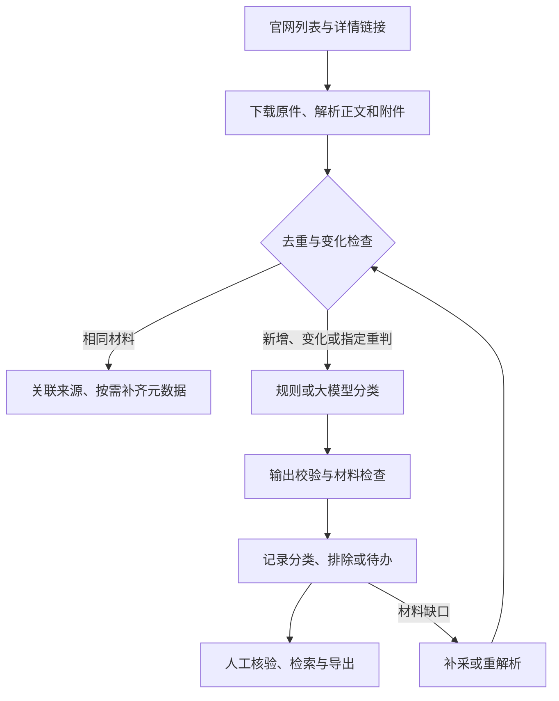

# 投资项目政策归集系统

> 🚀 **只想把它跑起来？看 [启动说明.md](启动说明.md)** —— 三步、约 5 分钟。
>
> 本文件是**汇报与验收说明**（讲清成果、业务口径、验证记录），篇幅长，不适合上手查阅。

面向发改条线投资政策研究，将政府官网分散发布的政策文件归集为可检索、可分类、可核验的政策资料库，支持项目谋划、政策对标与研究参考。

**交付定位：已形成可演示、可小范围试用的业务原型，尚未完成正式生产验收。** 当前重点应放在少量正确性问题收尾、独立业务验收和演示准备，不宜继续堆叠功能。

本说明核对日期为 **2026-09-14**（合并后重跑），代码基线为交付分支 **`release/integrated`**。
该分支由 `improve/policy-rules-source-audit`（来源覆盖与待办界面）与
`feat/scope-criteria-and-acceptance`（判定规则与业务验收）**合并而成**——两条线此前互不包含。

本次**均为实测重跑**，不是沿用历史数字：122 项测试、14 例业务边界集、
34 个来源独立验收、一轮全来源真实采集（5 分 45 秒）；CLI 与浏览器均在本机验证。
逐项结果与适用范围见第 4.1 节台账。

## 1. 汇报要点：解决什么问题、取得什么成果

传统政策整理的工作量不仅在下载，还在于判断“该不该收”、提取完整材料、区分转载与变化，以及处理模糊结论。本系统围绕两个核心建设：

1. **可维护的业务判断口径。** 区分政策正文与信息发布，判断条款是否实质作用于投资项目，再按四类归并；同一口径供规则与模型参考。
2. **可追溯的采集工程。** 适配政府官网不同列表机制，保存网页及附件原件，提取元数据，以版本、来源和复核记录串起完整处理链条。

| 已有成果 | 当前实现 | 汇报边界 |
|---|---|---|
| 政策采集链路 | 发现链接、下载、解析、分类、去重、入库、复核、导出 | 已有多个官网历史实采记录；不代表全国覆盖 |
| 标准化归集 | 标题、正文、发布日期、成文日期、文号、发文机关、来源、附件及分类 | 原文没有的信息留空，不猜测补齐 |
| 规则与模型双轨 | 无 API 可用规则；有服务时由模型读取正文与附件、分段判断 | 规则可运行不等于语义判断准确 |
| 四类多标签 | 引导、准入、保障、激励约束，可同时归多类 | 尚无独立、经过验收的主类判定字段 |
| 数据留痕 | 原件指纹、来源关联、采集版本、分类理由、人工复核历史 | 采集版本不等于政策法律修订或有效性 |
| 待办分流 | 材料、口径、结论、故障分别展示 | 分流不代表所有问题已自动解决，见第8节 |
| 材料修复 | 缓存重解析、失败补采、旧格式转换、永久死链识别 | 复杂扫描件、图形 OFD 等仍有缺口 |
| 评测工具 | 回归测试、业务边界样例、分层抽样、模型对比、双轮采集检查 | 程序测试与业务准确率分别验收 |

可用于汇报的概括：**已构建从官网采集到政策分类、资料留存和人工核验的完整原型；大模型负责语义研判，程序负责可重复的执行和质量检查，业务人员处理口径与疑难结论。下一阶段以提高归集可信度和减少人工核验工作量为重点。**

## 2. 设计思路与业务口径

### 2.1 先判断是否收录，再判断政策作用

顶层判据：文件是否对固定资产投资项目的形成、决策、审批、建设、要素保障、资金支持、监管或评价，提供普遍适用的规则、要求或支持。

- 范围内政策性文件不限于法律意义上的“行政规范性文件”；实施意见、工作方案、专项规划等也可能收录。
- 不要求整篇以投资为主；有实质项目条款即可，但仅引用他文、否定语境或泛泛提及项目不能直接视为支持依据。
- 单个项目批复、政策解读、会议通知、人事信息、采购结果等通常排除；“会议制度”等真正的制度文件应区别处理。
- 按本任务已记录的业务边界，纯存量企业运行端电价政策暂不纳入。混合文件如果直接规定项目建设或准入条件，仍需核对条款。
- 规则用强表述、项目生命周期表述、弱词及标题辅助判断；它是语义判据的近似实现，仍可能误收或漏收。

当前配置依据见 [classification.yaml](config/classification.yaml)。其中记录了2026-09-11业务沟通口径。历史 [边界讨论清单](docs/BOUNDARIES-v0.6.md) 保留当时的待确认状态，不应将其整份继续视为当前未决口径；残余争议应按具体条款继续确认。

| 类别代码 | 类别 | 回答的问题 | 典型内容 |
|---|---|---|---|
| `guide` | 引导类 | 往哪投 | 发展规划、产业导向、区域布局 |
| `access` | 准入类 | 让不让投 | 审批、核准、备案、环评、节能审查 |
| `guarantee` | 保障类 | 靠什么投 | 土地、资金、信贷、能耗、人才要素 |
| `incentive` | 激励约束类 | 投了怎样 | 奖补、优惠、价格支持、全过程监管、绩效及后评价 |

分类依据应落到条款实际作用。同一文件给予土地支持又规定奖补及绩效要求，可以归多类；不能把某个标签排在第一位就当作已经验证的“主类”。

### 2.2 技术流程



采用 Python、Flask、SQLite 与配置文件，方便本地部署和展示，避免为了原型引入额外服务。采集适配与分类分开，新增官网不必重写判断逻辑；业务口径调整也不必重写爬虫。

- 列表：支持静态 HTML、内嵌 recordset/CDATA、中国政府网公开 JSON、浙江 unitbuild 动态接口、
  江苏 TRS jpage、江西 CMS 的 `POST /queryList`（GET 该端点 404）这六种机制。
  链接可能在 `onclick` 里、文章 URL 形态各异、栏目页可能只是跳转桩——三处通用能力已补齐。
- 材料：正文与附件解析文本共同参与分类；原件保留 SHA-256 指纹，便于追溯和重解析。
- 去重：同文号与内容指纹辅助识别转载；同来源正文或附件变化产生采集快照，保留历史人工结论。
- 校验：检查 JSON 字段、类别、相关性、置信度及证据文本。当前采用原文匹配与字符片段覆盖检查；证据可匹配不等于结论正确，改写引用仍须核验。
- 效率：限制每批文件数、请求间隔、重试次数、文件大小和模型分段数量；相同材料复用结果，材料修复可使用本地原件。当前没有生产吞吐或净节省工时的实测结论。

### 2.3 如何理解这里的 Agent

当前实现是**任务驱动、状态分流、可修复的工作流**：程序收集材料，模型进行语义判断，程序校验结果，再依据状态决定继续入库、等待修复或交人处理。

| 状态 | 含义 | 谁处理 |
|---|---|---|
| `none` | 判定明确，无需人工 | 程序记录结果 |
| `material` | 材料缺失或未解析 | 机器补采/重解析；无法恢复时人工处理 |
| `system` | 模型配置或调用等故障 | 运维检查接口、配置和运行记录 |
| `candidate` | **规则判「收」且证据强——高置信候选** | 业务**抽检**翻转；**不自动入库** |
| `review` | 多类混杂、命中边界样例，结论需确认 | 业务人员查看原文后采纳、改判或剔除 |
| `scope` | 相关性判不出来，口径需裁决 | 业务负责人定口径 |

> **`candidate` 是业务方 2026-09-14 裁定的"中间档"**。规则模式另两种收口都不合适：
> 一律转人工（人工量接近全量，规则等于白写）、判正即自动确认（把机器建议当业务确认，
> 误收会静默进库）。折中是——机器很确定的那批单独成列，人**抽检翻转**而非逐条判；
> `need_review` 仍为真，**没被人看过之前它始终是一条待办**。
> 实测当前库有 **74 条**落在这一档；若沿用"判正即自动确认"，它们本该已经悄悄进库。
> 只有 **LLM 路径**在"模型判无需复核 + 置信度 ≥0.8 + 证据可原文定位"三条同时满足时可直接确认。

**本分支没有让 LLM 自主选择采集工具的规划器，也没有逐文件 Agent 时间线。** 补采通过命令触发，定期采集需要单独启动调度进程。将材料分流到“机器处理”不意味着机器已经后台自修。

没有 API 时，建议显式选择 `--prefer rule` 演示。若选择 `llm` 但服务不可用，会回退规则并记录 `rule_fallback`、故障原因和系统待办，不冒充模型成功。

## 3. 来源覆盖与材料能力

当前共配置 **34 个启用的真实来源、1 个停用的合成演示来源**，覆盖
**29 / 31 个省级地区**（另有国家层面 3 个来源）。

| 范围 | 来源数 | 说明 |
|---|---|---|
| 国家 | 3 | 发改委政策文件、发改委规范性文件、中国政府网最新政策（公开 JSON） |
| 省级 | 31 | 每省 1 个政策栏目；其中 **30 个省级地区已有实采数据**（仅缺甘肃） |
| 演示 | 1（停用） | 本地合成样例，不参与官网采集 |

**已接通 30/31，只剩甘肃 1 个省级地区未接通**（整个 `gansu.gov.cn` 域）。

湖北**本轮已接通**（`hubei_zcwj` / `hubei_gfwj`）。它确实是瑞数动态防护（每个请求都 412），
但 9/14 那句结论要更正：**不是"连 Chrome 也过不去"**——真实 Chrome 能过，过不去的只是纯 HTTP 客户端。
采集走"一次浏览器握手换 cookie + 全速 HTTP 抓取"，详见第 8 节。
（当时"无头 Chrome 卡死 6 分钟"是**我们自己的参数问题**：命令没带独立 `--user-data-dir`，
与正在运行的 Chrome 抢 profile 锁，不是站点拒绝。）

甘肃则**确属硬封锁**：JS 挑战能跑（瑞数 JS 文件 200），但重放被拒 **400**；
headless / 有头 / 指纹伪装都试过，本机 IP 一律 400 → 需代理 IP 或更高版本防护，
**建议判死并写进交付说明**。

> ⚠️ **口径提醒**：`SELECT COUNT(DISTINCT region)` 会得到 **32**，但那是
> **30 个省级地区 + 国家 + 样例**。对外只能说"**30/31 省级地区**"，
> 不能拿它当"覆盖 32 个省"。

各来源的栏目地址、翻页方式与已知限制见
[sources.yaml](config/sources.yaml) 的 `note` 字段（逐来源写明如何接入、踩过什么坑）。

`max_pages` 是配置上限，只有适配器真正支持翻页才有意义。`--limit` 是每个来源本批最多处理的候选数量，不能据此宣称采全。

| 格式 | 当前能力 |
|---|---|
| HTML、DOCX | 正文、元数据及 DOCX 表格文本提取 |
| 文本 PDF | 逐页提取与完整性检查 |
| 扫描 PDF | 可选本地 OCR，依赖 Poppler、Tesseract 与中文语言包；结果需核验 |
| 文本 OFD | 提取文本；图形、模板型复杂材料仍有限制 |
| 旧 DOC/WPS | 优先 LibreOffice；macOS 可回退 textutil，转换完整性需核验 |
| XLSX | 已有工作表文本提取能力，复杂公式、布局与语义关系仍需检查 |
| 其他格式 | 保留原件和失败/未解析状态，不冒充完整阅读 |

默认单文件下载上限20MB；PDF页数上限500页；OCR默认最多20页，可通过 `POLICY_OCR_MAX_PAGES` 调整，语言默认 `chi_sim+eng`。只有 Python 依赖不会自动安装转换/OCR工具。

404/410等永久死链与临时失败分开处理：有其他可用材料时可以继续判定并记明缺件；不能把“按现有材料判定”解释成“材料已齐全”。完全无材料时不能仅凭标题完成判断。

## 4. 测试结果与证据

### 4.1 验证台账

> **2026-09-14 合并后重跑的四行（本次独立验证，可复现）**：

| 验证项目 | 结果 | 证据与适用范围 |
|---|---|---|
| 单元/契约测试 | **112 passed** | `python -m pytest`（本机隔离环境）；证明"代码实现符合写下的规则" |
| 业务边界集 | **14 例：静默误收 0% / 漏收 0%**，待办分布 `none=4 candidate=3 review=6 scope=1` | `python scripts/acceptance_check.py`（规则模式）；证明"规则符合业务"，与上一行是**两回事** |
| 全来源独立验收 | **36 个来源：31 通过 / 5 需关注**（含归属检查；本轮新增的湖北两个均通过） | `docs/source-audit-all.json`（隔离临时库跑，语料为各栏目**抽样**，不等于全省覆盖率）。⚠️ 5 个需关注**都是抽样单条的个体问题，不是来源接不通**——这些来源都能正常发现 17–66 条：江苏/河南/新疆的材料不全、青海某条抓取失败（正文 0 字）、上海某附件未解析。抽样只取 1 条，样本换一条结论就可能变，别把它当来源级结论 |
| ⚠️ 验收证据文件 | `scripts/audit_sources.py` 的 `--output` **默认名是 `docs/source-audit.json`**，不带 `--output` 跑单来源验收会**静默覆盖**它（本轮就发现它已被覆盖成 1 个来源的残留）。权威文件是 `docs/source-audit-all.json`；跑验收请显式给 `--output` |
| 全来源实际采集一轮 | 34 个来源跑完，**5 分 45 秒**；库内 412 → **607 条**，覆盖 **29/31 省级地区**（当时缺湖北、甘肃） | 规则模式、每来源限 10 份，见下表"口径陷阱"；单源失败隔离不中断整批 |
| 湖北接通（本轮） | `hubei_zcwj` 与 `hubei_gfwj` 各跑一轮：**8 + 5 条全部入库，0 失败**；列表发现 1219 + 27 条；库内累计 620 条 / **30/31 省级地区** | 防护站，走浏览器握手；验收结论见 `docs/source-audit-hubei.json` |
| 库内待办分布 | scope 279 · review 181 · **candidate 74** · material 48 · system 19 · none 6 | 生产库 `data/policy.db`（已备份 `policy.db.bak-20260914-2335`） |

> **⚠️ 一个容易把覆盖率说多的口径陷阱**：`SELECT COUNT(DISTINCT region)` 会得到 **31**，
> 但那是 **29 个省级地区 + 国家 + 样例**。对外表述时必须说"**29/31 省级地区**"，
> 不能拿 31 当"覆盖 31 个省"。同理 `/provinces` 页把"中央"与"样例"单列，就是为了防这个误读。
>
> **`candidate 74` 是中间档在真实数据上的规模**：这 74 条规则判「收」且证据强，
> **没有静默入库**，等业务方抽检——若沿用"判正即自动确认"，它们本该已经悄悄进库了。

> 归入**历史记录**、不视为本次验证的：

| 验证项目 | 留存结果 | 证据与适用范围 |
|---|---|---|
| 当前基线回归 | 提交记录写明 **62 passed**，含死链放行、503仍阻断等测试 | [99f0afb提交记录](https://github.com/deyye/policy-collector/commit/99f0afbf1b820d6543c20b7c4106ec38b20c6949)；本次未复跑，不能视为本次独立验证 |
| 前序质量回归 | **60项通过**；覆盖重解析、人工结论保护、附件版本、抽样指纹和预检 | [v0.6记录](docs/REVIEW-v0.6.md)，属于历史版本 |
| 当前业务边界集 | **14例：正6、负8**，包含否定、引用、纯运行电价等 | [样本文件](validation/acceptance_cases.json)；是开发边界集，不是独立终审验收集；本次未运行 |
| 浙江列表发现 | 历史验证 **387条链接、27页**，末页为空 | [历史验证](VALIDATION.md)，不等于387份完整政策已入库 |
| 官网小批量采集 | 国家、中国政府网、重庆及浙江/江苏/福建/陕西/湖南有历史采集记录 | [原始批次统计](docs/validation_summary.json)、[v0.4记录](docs/VALIDATION-v0.4.md)；部分批次为partial |
| 材料修复 | 历史4附件小库中，完整解析由1个增至2个 | [v0.6记录](docs/REVIEW-v0.6.md)，不能外推至全库 |
| 最新死链修复 | 提交记录报告浙江库待补材料1→0 | [99f0afb](https://github.com/deyye/policy-collector/commit/99f0afbf1b820d6543c20b7c4106ec38b20c6949)；当前未取得该运行库独立复核 |
| 本轮文档核对 | 已核对分支、CLI参数、模块、配置、评测JSON及关键处理路径 | 未执行程序；查询该分支 GitHub Actions 未见运行记录 |

### 4.2 历史真实模型探索结果

仓库留存56份浙江样本的模型比较，模型字段记录为 `deepseek-v4-flash`。以下直接取自 [eval_report_v0.5.json](gold/zj_v1_20260909/eval_report_v0.5.json)，对应历史口径，**不是当前分支重新评测的结果**。

| 指标 | 历史规则基线 | 历史模型结果 |
|---|---:|---:|
| 相关性精确率 | 61.90% | 90.62% |
| 相关性召回率 | 70.27% | 78.38% |
| 相关性F1 | 65.82% | 84.06% |
| 四类标签微平均F1 | 45.16% | 60.71% |
| 整篇完全一致率 | 8.93% | 37.50% |
| 待判定 | 14/56 | 17/56 |
| 需人工复核 | 56/56 | 43/56 |

模型记录为56条完成、0失败、0回退、0输入截断；历史文字记录耗时10分49秒。**56条标签全部为AI初标、人工终审数为0**，21条存在附件不完整。90.62%是相对这些初标的正类精确率，不是整体准确率，也不包含官网漏发现和已排除文件的漏收。

这轮探索表明模型有改善语义判断的潜力，同时暴露材料、证据与类别边界问题。不能写成“准确率已达90%”或“当前已减少76.8%人工工作”；43/56恰好是当时需复核比例，净节省工时尚未测量。历史文字报告中的解释分歧以 [后续复核说明](docs/REVIEW-v0.6.md) 为补充，不将差异一概归因于评分口径。

### 4.3 如何复验

在仓库根目录、已激活虚拟环境时执行：

```bash
python -m pip install -r requirements-dev.txt
python -m pytest -q
python scripts/acceptance_check.py --prefer rule --verbose
```

回归测试验证程序行为；14例边界集检查规则的已知误收、漏收和待复核表现。当前验收脚本仅在“静默误收”存在时返回1；**退出码0仍不保证没有漏收**。其中“需人工介入率”还把已知误收和漏收计入，不等于实际人工队列占比。应阅读分项结果，后续完善门禁。

独立业务验收应从完整材料重新取样、由业务人员终审，并将开发集与验收集分开：

```bash
python scripts/quality_tasks.py sample --limit 20 --out data/audit-new
python scripts/validate_batch.py --sample-dir data/audit-new --out-dir data/batch-preflight --dry-run
```

可加 `--reference-list data/reference.jsonl` 对照人工独立取得的官网列表，每行含 `page_url`、`title`、`source_name`、`list_url`。省略独立列表就不能检验列表漏发现。按脚本要求填写终审标签后再评分和调用真实模型；使用新的输出目录，避免覆盖冻结样本。完整步骤见 [历史质量操作说明](docs/REVIEW-v0.6.md) 及各脚本 `--help`。

## 5. 每个目录和模块做什么

### 5.1 目录导航

| 路径 | 用途 |
|---|---|
| `policy_collector/` | 应用核心：采集、解析、分类、数据库、调度、CLI和Web |
| `policy_collector/templates/` | Jinja页面：首页、政策列表/详情、来源、运行、材料质量、模型设置及公共组件 |
| `policy_collector/static/` | 页面样式，目前为 `style.css` |
| `config/` | 运行参数、官网来源、业务分类口径，分别为三个YAML文件 |
| `scripts/` | 手动验证、来源探测、材料修复、抽样与模型评测工具 |
| `tests/` | 自动回归测试；`conftest.py` 提供测试配置与隔离环境 |
| `samples/policies/` | 合成政策与反例，供离线demo使用 |
| `samples/gov/`、`samples/zj/`、`samples/jiangsu/` | 官网结构样例，验证列表与详情适配；不代表实时官网状态 |
| `samples/list.html` | 本地样例列表入口 |
| `validation/` | 业务边界样本 `acceptance_cases.json` |
| `gold/zj_v1_20260909/` | 56条历史样本、AI初标、预测、快照节选及评测报告，不是终审金标准 |
| `docs/` | 历史方案、质量审查、边界讨论、接入与验证记录；按日期和版本阅读 |
| `docs/ui/` | 静态界面说明与预览HTML；不是实时应用，也不保证同步最新待办页面 |
| `data/`（运行生成） | 默认SQLite数据库、下载原件、本机模型配置、日志/验证产物；不入Git |
| 根目录依赖文件 | `requirements.txt` 为运行依赖，`requirements-dev.txt` 增加pytest |
| `.env.example`、`.gitignore` | 环境配置示例及本机数据/密钥等忽略规则 |

### 5.2 核心代码职责

| 文件（位于 `policy_collector/`） | 职责 |
|---|---|
| `__init__.py`、`config.py` | 包版本；读取YAML、环境变量、本机模型配置与数据路径 |
| `models.py` | 文档、分类、附件等结构化数据对象和待办字段 |
| `collector.py` | HTTP请求、大小限制、重试限速、链接发现与来源范围约束 |
| `site_adapters.py` | 不同官网列表接口和详情页结构适配 |
| `parser.py` | 提取网页正文、标题、文号、日期、机关与附件入口 |
| `attachment_parsers.py` | PDF、OFD、XLSX、旧DOC/WPS转换与OCR等附件处理 |
| `classifier.py` | 规则判定、模型提示、分段汇总、证据校验及待办推导 |
| `todo.py` | 待办类型的元数据（中文名/责任方/说明）与"材料是否完整"的**唯一判据** |
| `agent.py` | 采集中间步骤的记录与进度上报 |
| `llm_client.py` | OpenAI兼容JSON请求、超时重试、错误及token用量 |
| `model_settings.py` | 模型设置保存、密钥保护及最小连接检查 |
| `dedup.py` | 政策身份键、内容指纹与重复/变化识别 |
| `db.py` | SQLite表结构与迁移、查询、版本、来源关联、审核历史和统计 |
| `pipeline.py` | 串联采集至入库、增量检查、重判及批次结果 |
| `quality.py` | 材料完整性报告、补采候选选择、原件重解析与分类更新 |
| `sampling.py` | 分层抽样、材料冻结、开发/验收分组与人工评分 |
| `evaluation.py` | 相关性、多标签、完全一致率等评测指标 |
| `locking.py` | 采集/修复进程互斥，避免冲突写入 |
| `scheduler.py` | 按间隔循环运行启用来源 |
| `cli.py` | 命令入口：初始化、采集、查询、复核、导出、调度及Web启动 |
| `webapp.py` | 页面路由、表单校验、人工复核、采集触发和材料下载 |

主要数据表包括：`source_configs`（来源）、`fetch_records`（候选与处理状态）、`policies`（政策及版本）、`attachments`（附件）、`attachment_attempts`（附件处理尝试）、`policy_sources`（来源关联）、`review_events`（人工及处理变更）、`run_logs`（批次结果）。升级前备份数据库与原件目录；运行中的SQLite应使用backup接口生成一致快照，不只复制可能遗漏WAL的主文件。

### 5.3 脚本与测试分工

| 文件（位于 `scripts/`） | 用途 |
|---|---|
| `probe_sources.py` | 探测官网入口及列表机制，为逐站适配提供依据 |
| `zj_live_check.py` | 浙江动态列表和详情的联网验证 |
| `zj_full_ingest_check.py` | 浙江隔离库批次/双轮验证，分别检查发现、处理、材料与幂等 |
| `quality_tasks.py` | report材料报告、repair补采、sample抽样、score评分 |
| `acceptance_check.py` | 运行14例业务边界集，打印静默误收、漏收、待复核等 |
| `audit_sources.py` | **逐来源独立验收**：列表发现→详情→附件→入库，含归属检查；用隔离临时库，不碰生产库 |
| `discover_provinces.py` | 批量探测省级官网入口与列表机制（保持原协议、按"文章型链接数"判栏目） |
| `backfill_todo_type.py` | 给已有条目回填待办类型；**默认干跑**，`--mode rejudge` 可用新规则重判 |
| `refresh_material_flags.py` | 重算材料标记（`parse_requires_review`），默认干跑 |
| `evaluate.py` | 已有标签与预测的指标评价 |
| `eval_llm_compare.py` | 冻结数据库快照，对比规则与模型，保存预测、指纹及用量 |
| `validate_batch.py` | 小批量模型评测，先检查材料、标签、分组和配置 |

| 文件（位于 `tests/`） | 主要覆盖 |
|---|---|
| `test_smoke.py` | 离线demo、基础页面与核心流程 |
| `test_regressions.py` | 元数据、附件、去重、模型回退、表单、边界判定等回归 |
| `test_expansion.py` | 扩展官网适配、分页、正文和元数据处理 |
| `test_quality.py` | 材料质量、评测指标与模型配置等 |
| `test_material_repair.py` | 重解析、人工结论保护、格式转换、补采与死链处理 |
| `test_todo.py` | 待办类型：中间档不静默入库、材料判据、统计与过滤读同一字段 |
| `test_jx_query_source.py` | 江西接口型列表的**离线**契约（必须 POST、URL 拼法、空页停止），不联网 |
| `test_ingestion_contract.py` | 入库契约：通用词不构成"收"、事务性公告判否但不误杀真政策 |
| `test_review_fixes.py` | 暂定的"否"归复核队列而非排除日志；模型恢复不覆盖人工结论 |

## 6. 服务怎么启动

### 6.1 首次安装

使用 Python 3.10+。以下在终端执行：

```bash
git clone --branch feat/scope-criteria-and-acceptance https://github.com/deyye/policy-collector.git
cd policy-collector
python -m venv .venv
```

macOS / Linux 激活：

```bash
source .venv/bin/activate
```

Windows PowerShell 激活：

```powershell
.venv\Scripts\Activate.ps1
```

安装运行依赖：

```bash
python -m pip install -r requirements.txt
```

### 6.2 不配API，先跑离线演示

先设置独立演示数据目录，避免把合成文件混入真实政策库。macOS / Linux：

```bash
export POLICY_DATA_DIR="$PWD/data-demo"
```

Windows PowerShell：

```powershell
$env:POLICY_DATA_DIR = Join-Path (Get-Location) "data-demo"
```

随后执行：

```bash
python -m policy_collector.cli init-db
python -m policy_collector.cli demo
python -m policy_collector.cli web --host 127.0.0.1 --port 8000 --open
```

浏览器打开 [本地工作台](http://127.0.0.1:8000)。保持终端运行，Ctrl+C停止Web。端口占用时换 `--port 8001`。后续只看已有数据，直接执行最后一条命令即可。

`demo` 使用合成样例和规则，不需要网络或模型密钥；它会在所选数据库中写入样例。切换真实库时，在macOS/Linux执行 `unset POLICY_DATA_DIR`，PowerShell执行 `Remove-Item Env:POLICY_DATA_DIR`，再初始化并重启服务。默认库是 `data/policy.db`，原件在 `data/downloads/`。

### 6.3 配置模型与真实采集

网页“模型配置”可填写兼容服务地址、模型名和密钥，然后检查连接。也可命令行交互输入密钥：

```bash
python -m policy_collector.cli configure-llm --provider dashscope
python -m policy_collector.cli llm-check
python -m policy_collector.cli run --source zjfgw_gsgg --prefer llm --limit 10
```

默认YAML预置百炼兼容地址和 `qwen-plus`，不代表已经提供可用密钥，也不是历史评测所用模型。自定义服务使用 `configure-llm --provider custom --base-url 服务地址 --model 模型名`。

当前分支的客户端要求非空密钥，**尚不支持直接免密连接本地模型**。已部署的本地兼容服务如有鉴权，可按自定义服务配置；免密适配属于后续优化，不会自动下载或部署模型。

配置优先级为：非空进程环境变量 > 非空根目录 `.env` > 本机 `data/llm.local.json` > YAML。密钥不回显，本机文件不加密且不入Git；演示或分享数据目录时不要带出密钥。用 `doctor` 检查配置，`llm-check` 才会发出最小模型请求并产生少量用量。

没有模型也可联网采集：

```bash
python -m policy_collector.cli run --source zjfgw_gsgg --prefer rule --limit 10
```

规则模式存在已知误收边界，不能将其自动确认结果直接用作正式归集结论。模型恢复后，显式重判未人工确认记录：

```bash
python -m policy_collector.cli run --source zjfgw_gsgg --prefer llm --reclassify --limit 20
```

### 6.4 定期采集、补材料与导出

Web与调度是两个独立进程。另开终端、激活同一环境并使用同一数据目录：

```bash
python -m policy_collector.cli schedule --source zjfgw_gsgg,ndrc_ghxwj,gov_latest --interval 60 --limit 20
```

调度先运行首轮，再于每轮结束后等待60分钟；终端需要持续运行。可加 `--cycles 2` 做双轮观察。`web` 不会自动启动调度；当前未交付常驻服务或Docker编排。

```bash
# 失败文件补采
python -m policy_collector.cli run --source zjfgw_gsgg --retry-only --limit 10

# 质量报告与材料修复；输出路径每次使用新名字
python scripts/quality_tasks.py report --out data/quality-before.json
python scripts/quality_tasks.py repair --local-only --prefer rule --limit 10 --out data/repair-local.json
python scripts/quality_tasks.py repair --prefer llm --limit 10 --out data/repair-online.json
python scripts/quality_tasks.py report --out data/quality-after.json

# 导出人工确认项；adjusted为人工改判后采纳的另一组
python -m policy_collector.cli export --format csv --review confirmed --out data/confirmed.csv
python -m policy_collector.cli export --format json --review adjusted --out data/adjusted.json
```

默认查询/导出包括当前版本的待办候选，不能把默认导出当作已确认政策清单。运行出现 `partial` 时查看附件、正文和模型回退计数；命令完成不表示材料完整。

当前Web是本地开发服务，未实现用户登录、角色权限和生产服务治理。汇报用默认回环地址即可；正式多人使用应再补鉴权、生产进程管理和备份恢复验证。

## 7. 汇报演示顺序（约5分钟）

1. **业务目标与口径（1分钟）**：解释为何不仅是爬虫，展示四类分类与“部分条款涉及即可、纯运行端政策排除”的任务边界。
2. **来源与数据（1分钟）**：展示实际配置的国家/浙江/外省来源，区分来源已配置、链接已发现、正文已处理与材料完整。
3. **一份完整政策（1分钟）**：打开真实文件，查看文号、日期、正文、附件、分类理由、来源与版本。
4. **一份待办文件（1分钟）**：展示为什么要人处理或补材料，查看原文并演示复核留痕。当前待办清除存在第8节问题，不承诺复核后计数立即归零。
5. **成果与下一步（1分钟）**：引用第4节有证据的历史结果，说明独立业务验收、少量正确性修复和重点来源补齐计划。

离线样例用于兜底展示，明确标记为合成数据；真实采集和模型评测使用事先准备的记录。不要现场以长时间全量采集或临时API成功作为演示成立的前提。

## 8. 还值得优化什么

**2026-09-14 合并后已修复的（原先列为本节"优先收尾"）**：

| 原问题 | 处置 | 证据 |
|---|---|---|
| `db.audit()` 清除 `need_review` 但未同步 `todo_type`；页面与列表按后者统计/筛选 | **已修**：复核后同步 `todo_type`——剔除/人已复核 → 出队；材料还没齐 → 转"材料待补"（机器/运维的活）。实测库副本上候选 74 → 73，该条出队 | `tests/test_review_fixes.py::test_business_review_keeps_material_warning` |
| LLM 允许"不收但需复核"；`pipeline._ingest_url()` 新文件路径遇 `no` 直接排除 | **已修**：`_classify_document()` 把"暂定的否"改判 `pending` 归复核队列，三个调用点都已接回 | `test_negative_review_is_retained` |
| 关键词查询未覆盖附件解析文本 | **已修**：`query_policies(keyword=...)` 已查附件文本，并返回命中文件名与片段 | `tests/test_review_fixes.py` 的附件命中用例 |
| 引用他文可同时命中多个强词、可能自动确认 | **已缓解**：中间档下判「收」不再自动确认，落 `candidate` 供抽检；但**不改变"它会被判收"这件事** | `validation/acceptance_cases.json` 的 `boundary-yinyong` 持续跟踪 |
| 事务性公告（比选/中选/获奖/公示…）因"方案"等词触发豁免而误收 | **已修**：排除词分软/硬两组，事务性词不享豁免；10 例正反用例固化 | `tests/test_ingestion_contract.py::test_transactional_notices_are_excluded_without_killing_real_policies` |

**以下仍未做**（本轮只做正确性收尾，未新加功能）：

| 优先级 | 当前发现 | 建议与完成标准 |
|---|---|---|
| 优先收尾 | 边界集已注明引用他文可同时命中多个强词；运行电价排除主要看标题 | 引用、否定、混合条款不能仅凭词数自动确认；用原文条款验收，避免用同一开发集宣称泛化准确率 |
| 汇报后近期 | 运行页为13列表格和6秒刷新，没有逐文件阶段及耗时；启动按钮检查锁和获取锁之间有窗口 | 简化为当前文件、阶段、数量、异常；请求中原子占用运行锁，连点不启动多次任务 |
| 汇报后近期 | 材料待办不全可自修，模型恢复也需要主动重判；无本地免密支持 | 明确处理责任，增加有限自动修复/回退补判和本地服务适配，保留上限与操作记录 |
| 汇报后近期 | **甘肃整域防护未接通**（湖北本轮已接通） | 甘肃只差代理 IP 或更高版本防护；建议判死并写进交付说明 |
| 试用验收 | 只有历史AI初标比较，缺当前独立终审集与工时统计 | 终审完整材料，分别量误收、漏收、四类F1、需接管比例、每篇复核分钟数 |
| 按需扩展 | 多数外省只接首页或当前列表页；复杂附件和政策有效性仍有限制 | 先补重点省份翻页和附件，双轮验证；有效性另建明确标注流程，不从采集日期推断 |

验收脚本还应把关键漏收计入失败门禁，并将“实际待办比例”和“评测错误比例”分开。建议接入CI保存可追溯测试结果，再讨论长期稳定性、费用预算、来源告警与生产并发。

**收尾判断：主流程和汇报素材已经具备。完成上述正确性收尾并通过一次目标机器演示后，适合进入小范围业务试用；正式上线应以独立业务验收和持续运行结果为依据。**

## 9. 历史资料索引

- [v0.6质量改进与历史结果复核](docs/REVIEW-v0.6.md)
- [v0.5质量审查](docs/QUALITY-v0.5.md)
- [国家、浙江及重庆等早期验证](VALIDATION.md)
- [外省扩展验证](docs/VALIDATION-v0.4.md)
- [历史模型报告与标签](gold/zj_v1_20260909/README.md)
- [静态UI预览说明](docs/ui/README.md)

```bash
python -m policy_collector.cli sources
python -m policy_collector.cli run --source gov_latest --prefer rule --limit 5
python -m policy_collector.cli run --source cq_normative --prefer rule --limit 5
python -m policy_collector.cli run --source zjfgw_gsgg --limit 15
python -m policy_collector.cli run --source jsfgw_tzgg --limit 5
python -m policy_collector.cli run --source fj_normative --limit 5
python -m policy_collector.cli run --source sx_normative --limit 5
python -m policy_collector.cli run --source hn_local_rules --limit 5
python -m policy_collector.cli run --source all --limit 20
python -m policy_collector.cli run --source ndrc_ghxwj --retry-only --limit 10
python -m policy_collector.cli schedule --source ndrc_ghxwj,gov_latest,cq_normative,zjfgw_gsgg,jsfgw_tzgg --interval 60 --limit 20
```

`run` 默认使用大模型，`--prefer rule` 明确选择规则基线。`schedule` 立即运行首轮，之后每轮完成后间隔指定分钟，进程需要持续运行；本次交付没有在后台替你部署常驻任务。可用 `--cycles 2` 验证两轮后退出。缺省只运行启用且非本地演示的来源，Ctrl+C 在当前工作结束后退出。服务器可使用系统定时器调用单次 `run`。

每次既发现新链接，也按最近检查时间轮转复查已有链接。`--limit` 是每来源本轮最多处理的文件数，**不是已覆盖整站**；持续大量新增时旧记录复查可能推迟；已检查过的失败项按检查时间轮转，不再永久优先于旧文件。`max_pages` 是发现页数上限，历史补录需扩大页数并分批运行。

失败候选留在 `fetch_records`；附件下载失败可补采。没有发现链接视为来源异常，不伪装成成功。运行状态区分 `ok / partial / failed`，CLI 分别返回 0 / 1（运行有异常或模型回退）/ 2（参数配置错误）。发现列表成功不表示所有文件或附件成功，应一起查看运行统计。`documents_incomplete` 表示正文定位或解析不完整，`attachments_unparsed` 表示附件已下载但正文未完整解析；这两类也会使运行标记为 `partial`。

浙江 `zjfgw_gsgg` 为 hanweb「页面构建单元」动态列表：栏目页声明 unitbuild 参数 → GET JPaaS 单元接口的 `data.html`。已实现**逐页全量翻页**（paramJson pageNo/pageSize，空页自停），真实源验证 387 条/27 页（2020-01 至 2026-06），见 [接入记录](docs/EXPANSION.md)。

江苏 `jsfgw_tzgg` 为 TRS jpage 站点：列表首页由 `<script>` 内嵌 `<datastore><recordset>` XML(CDATA) 输出最新 30 条，`ListPageParser` 通用展开解析。**当前 `max_pages=1`（仅覆盖首页，运行间隔内新增超过首页容量可能漏采），历史翻页（dataproxy POST/XML、多单元）与「行政规范性文件」目录（JS 渲染）尚未接入**；该栏目混有价格公告/招聘公示，待复核噪音较高，投资政策使用建议改接规范性文件栏目。

省级来源覆盖范围：

| 来源 | 栏目 | 当前发现范围 |
|---|---|---|
| `zjfgw_gsgg` 浙江 | 行政规范性文件 | 动态翻页，上限 40 页，空页停止；本轮复验前两页 30 条 |
| `jsfgw_tzgg` 江苏 | 通知公告 | 首页 30 条；有招聘、价格等非投资信息，必须筛选 |
| `cq_normative` 重庆 | 行政规范性文件 | 当前列表页；沿用既有适配 |
| `fj_normative` 福建 | 行政规范性文件库 | 当前配置可发现 15 条详情链接，未接历史翻页 |
| `sx_normative` 陕西 | 行政规范性文件 | 当前列表页 20 条，未接历史翻页 |
| `hn_local_rules` 湖南 | 地方性法规规章 | 当前列表页 20 条，未接历史翻页 |

以上数量为 2026-09-09 小批量验证时的发现结果，并非已入库的正式政策数量。浙江中途失败时，已成功页的链接仍入队，来源记录错误；重复页不再视为正常结束。其余来源的历史翻页应逐站验证后扩展，不能仅增大 `max_pages` 就声称全量。

停用来源不能由 `run/schedule` 执行。

---

# 工程记录

> 以上是**面向汇报**的 README（来自 `feat/scope-criteria-and-acceptance`）。
> 以下是**工程过程记录**——省级来源接入、一键全国采集、待办清单、各轮实测结论
> （来自 `improve/policy-rules-source-audit`）。
>
> 两条并行分支已于 2026-09-14 合并为交付线 **`release/integrated`**：
> 一条强在**判定规则与业务验收**，一条强在**来源覆盖与界面**，此前互不包含。

## 合并两条分支（2026-09-14）

**为什么必须合**：两条线各有硬资产，且**没有单方向领先**——按提交数是本分支领先 17 个，
按提交时间与规则成熟度是另一条最新（当天 23:06）。分叉点在 `c1626b1`：

| | `feat/scope-criteria-and-acceptance` | `improve/policy-rules-source-audit` |
|---|---|---|
| 最新提交 | 09-14 23:06（汇报 README） | 09-14 01:10 |
| 采集覆盖 | 8 个地区 / 9 个来源 | **27 个地区 / 31 个来源** |
| 判定规则 | **分档判据**（强/弱档 + 项目生命周期词） | 旧版 `scope-v3`（对象+动作同句共现） |
| 业务验收 | **14 例困难样本 + 静默误收率指标** | 无 |
| 界面 | 首页待办 | **`/provinces` 按省浏览 + `/todos` 待办清单** |

业务方裁决：**合并**（"规则全的"＋"省份全的"），合并后保留两条原分支不动。

### 合入了什么

- **规则层整体取自另一条分支**：`config/classification.yaml`、`policy_collector/classifier.py`、
  `validation/acceptance_cases.json`、`scripts/acceptance_check.py`；
  `models.py` 增加 `todo_type`，`db.py` 增加该列（自动迁移）。
- **本分支的省份与界面全部保留**：31 个启用来源、`/provinces`、`/todos`、一键全国采集、进度页。
- **补回了两处被自动合并丢掉的能力**（都是"对方的改动落在非冲突区、被我方整份覆盖"导致的）：
  1. `attachment_parsers.is_permanent_download_error`——区分"站点 404/410 永久失效"与
     "超时/5xx 暂时失败"，否则一条死链会把政策永远钉在"待补材料"队列里空转；
  2. `_classify_document()` 里的**"暂时性的否"保护**——判否但标记需复核的条目归复核队列，
     而不是进排除日志；合并后这个函数一度变成死代码，已恢复在三个调用点使用。
  3. LLM 侧的**多标签独立证据校验**（`category_evidence`）：模型给两个类别却只给一条
     证据时，缺证的那一类标为待确认；同时把该字段写进提示词的输出格式。
- **待办口径统一为"存一次、各处读"**：原来一条线用 CASE 表达式临时推导、另一条用列，
  合并后**只由分类环节派生后落库**，查询层不再重复实现——两套口径一旦漂移，页面上就对不上账。

### 中间档：判「收」且证据强 → 高置信候选（业务方 2026-09-14 裁决）

规则模式原有两种收口方式都不合适：**一律转人工**（人工量接近全量，规则等于白写）、
**判正即自动确认**（把机器建议当业务确认，误收会静默进库）。现改为中间档：

- 规则判「收」且强判据达标 → `todo_type='candidate'`（**高置信候选**），
  **不自动入库**，单独成列供业务**抽检翻转**，而不是逐条判；
- `need_review` 仍为真——**没被人看过之前，它始终是一条待办**；
- 相关性判不出来 → `scope`（待定口径，要业务方拍板）；多类混杂/命中边界样例 → `review`。
  这两类才是"需你处理"的逐条队列（`todo.HUMAN_QUEUES`），候选是抽检、不计入。
- **LLM 路径不受此限**：模型判无需复核 + 置信度 ≥0.8 + 证据可原文定位时仍可直接确认。

这一档顺带堵住了一个**已知残留风险**：验收样本 `boundary-yinyong`（判「收」但其实
是书名号内引用他文）原先会"疑似自动确认"，现在落到候选队列，不再静默入库。

### 合并后的验证

- **108 项测试通过**（合并前两条线分别为 105 / 61）。
- **业务验收（规则模式，14 例）**：静默误收 **0%**、漏收 **0%**、需人工介入 71.4%；
  待办分布 `none=4　candidate=3　review=6　scope=1`。
- 合并后做了一次**重复定义体检**（两分支都改过同一批文件，容易出现同名方法被静默覆盖）：
  0 处。
- **库内回填**：`scripts/backfill_todo_type.py`（默认干跑）。已按**保守模式**回填
  ——只从既有字段推断待办类型，**不动任何判定结论**：
  `material 32 / system 19 / review 120 / scope 225 / none 5`。
  另有 `--mode rejudge` 可对 `rule` 条目用**合并后的规则**重跑判定（干跑结果：
  `candidate 96 / review 93 / scope 78 / none 83`）——**会改变 318 条的判定结论**，
  需业务方确认后再执行。

### 合并后仍需注意

- `scope=225` 偏多，是**旧规则过保守**留下的：旧 `scope-v3` 把 254 条判成"待判定"。
  要么用新规则重判（见上），要么接受这批就是要找业务方定口径。
- 弱词不足阈值的事务性通知会被**直接判否**（漏收方向），这是"低误收"换来的代价，
  详见 `tests/test_ingestion_contract.py::test_two_generic_keywords_are_not_a_policy` 的说明。

## 5. 数据、去重与人工复核

SQLite 默认 `data/policy.db`，网页及附件按 SHA-256 不可变留存在 `data/downloads/<source>/`。保留原文链接与正文位置；缺失日期或文号留空，不用猜测值填充。发布日和成文日分别存储。

- 同文号、正文与附件指纹一致：不重复插入，保留转载来源。
- 同一原网址正文或附件变化：追加版本并重新待复核，保留历史版本及历史人工决定。
- 同文号但其他网址内容不同：保留独立待复核记录和关联键，不擅自认定为正式修订。
- 无文号：使用发文机关/来源与完整标题，保留年份、试行等括号内容；宁可待复核，不强行跨站合并。
- 网页版式、正文空白变化不生成新版本。同一来源重复内容可补齐原先为空的文号、发布日期、成文日期和发文机关，写入 `metadata_backfill` 留痕；已填值、人工分类和既有身份键保持不变；网址恢复历史相同版本不会把旧版覆盖成当前版。版本号代表采集内容快照，不代表法律修订次数。

主要表：`source_configs` 来源；`fetch_records` 发现和下载状态及分类快照；`policies` 政策内容与版本；`attachments` 附件与解析结果；`policy_sources` 转载来源；`review_events` 复核前后快照；`run_logs` 运行结果。旧库启动时补充字段和表，升级前请备份数据库及下载目录。

```bash
python -m policy_collector.cli query --review pending
python -m policy_collector.cli audit --id 1 --action adjust --category guarantee,incentive --note "已核对资金支持和绩效条款"
python -m policy_collector.cli export --format json --out data/policies.json
python -m policy_collector.cli export --format csv --out data/policies.csv
```

默认查询、导出仅含当前版本并排除已剔除项；待复核项仍包含在候选库中。正式使用前可分别按 `--review confirmed`、`--review adjusted` 导出人工通过项。JSON/CSV 均含正文、附件和来源信息，CSV 对公式起始字符进行转义。

PDF 文本和 DOCX（含表格）可以解析；**XLSX 与旧版 DOC/WPS 亦可解析（2026-09-13 新增）**——XLSX 走 `zipfile`+`lxml` 直读共享字符串，旧 DOC/WPS 优先 LibreOffice、macOS 上回退系统自带 `textutil`（`.wps` 实为 OLE 复合文档，须按 `.doc` 落盘后交给 textutil）。扫描 PDF 标记需 OCR；XLS/PPT 仍需 LibreOffice。默认每文件最大 20MB，PDF 最多 500 页，可根据运行环境审慎调整。附件解析缺失时进入待复核并标记部分完成；HTTP 200 返回的 HTML 错误页也不会当作附件下载成功。

## 6. 测试、效果评价与交付边界

```bash
pip install -r requirements-dev.txt
python -m pytest -q
```

**注意（2026-09-14 更新）**：pytest 的 `tmp_path` 会去建 `{临时目录}/pytest-of-<user>`，
该目录**只要已存在**就会因沙箱对已存在目录的 mkdir 抛 `PermissionError`，
表现为"几十个 ERROR 而不是测试失败"。换新目录能躲一次，但只要旧目录还在就会复发。
**正解是显式指定 `--basetemp`**（pytest 会自己接管该目录的创建与清理）：

```bash
D="$PWD/.bt$(date +%s)"; mkdir -p "$D" && TMPDIR="$D" python -m pytest -q --basetemp="$D/bt" && rm -rf "$D"
```

回归测试 **105 项**全部通过。覆盖全文及附件输入、JSON 验证、年度文号区别、转载、版本变化、失败刷新、旧库迁移、事务回滚、定时来源筛选、网页复核和来源过滤，以及浙江 unitbuild 参数提取/元数据表/全量翻页、江苏 recordset 列表与 TRS_Editor 详情、批量采集的单源失败隔离、Web 表单令牌等。浙江与江苏均有离线快照样本（`samples/zj/`、`samples/jiangsu/`）不依赖网络。模拟模型只能验证接口与流程，不能验证模型理解能力。

站点探测与接入流程（扩展新省份）：

```bash
python scripts/probe_sources.py https://某省发改委首页   # 判定列表机制与建议配置
python scripts/zj_live_check.py                          # 浙江动态列表全量翻页只读验证
```

来源历史探测见 [接入记录](docs/EXPANSION.md)。陕西已在 v0.4 使用可访问的规范性文件栏目接入，旧探测失败记录不代表当前接入状态。最新小批量实测与限制见 [v0.4 验证说明](docs/VALIDATION-v0.4.md)。

v0.5 程序交付轮次只做程序回归与官网连通验证；随后已用 AI 初标样本补做一轮探索性比较（结果见 §7 末）。**人工验收用的独立标注集仍待业务人员完成**。每行一个 JSON，示例结构为：

```json
{"id": 1, "relevant": true, "categories": ["guarantee", "incentive"], "label_status": "human_reviewed"}
```

这只是格式示例，**不是对数据库 ID 1 的实际标注**。使用覆盖四类、非相关与边界材料的人工标注集执行：

```bash
python scripts/evaluate.py --db data/policy.db --gold gold.jsonl
```

输出相关性精确率/召回率/F1、类别微平均指标、整篇完全一致率，以及 pending、需人工复核、输入截断、模型回退数量。多个脚本统一使用同一指标实现；pending 不算正确的非相关判断。该脚本只评价已入库且标注的候选，不能衡量网站发现召回率；应另外抽查官网栏目是否漏采，并查看被排除的 `fetch_records.classification_json`。业务验收还需记录关键字段准确率、附件成功率和每篇人工核验耗时。

**尚需完成的验收：** 人工终审标注口径、配置模型并做独立真实盲测；按 v0.5 的严格判定复核浙江全量运行结果（旧脚本的 overall_ok 未检查所有未处理候选和附件，不作为完整验收依据）；江苏历史翻页与规范性文件栏目；安徽/江西等省份的数据接口适配；按实际样本决定是否接入 OCR/OFD/旧 Word。未完成这些工作前，不应汇报为已实现全国覆盖或可无人审核直接用于正式政策适用判断。

## 7. v0.5：先预检，再比较，再人工验收

先使用**原标注采样库**预检，无需 API Key，也不会调用模型：

```bash
python scripts/eval_llm_compare.py --src-db /tmp/pc_zj_full/policy.db --gold gold/zj_v1_20260909/gold.jsonl --out-dir /tmp/pc_eval_preflight_new --dry-run
```

预检按来源网址和内容指纹定位版本，再检查标题、文号和附件完整性。重建库即使 ID 相同，也不一定对应原样本；不匹配时应恢复原采样库或重新核对标注版本，不能删除指纹来绕过检查。`policies_snapshot.jsonl` 只有正文节选，不能代替完整采样库和附件。

确认模型连接后，用另一个空目录做探索性比较：

```bash
python scripts/eval_llm_compare.py --src-db /tmp/pc_zj_full/policy.db --gold gold/zj_v1_20260909/gold.jsonl --out-dir /tmp/pc_eval_model_new --allow-provisional
```

产物包括 `policy_snapshot.db`（不改写的数据库快照）、`predictions.jsonl`（逐条规则/LLM 输出及用量）、`report.json`。逐条结果立即落盘；连续三次服务失败停止后续调用，剩余样本明确计未执行。报告区分历史存量预测 `stored_predictions`、当前规则 `rule_baseline`、本轮端到端模型路径 `llm`；后者包含显式回退，必须结合 `llm_reclassify` 看实际成功数。失败不再沿用旧规则预测冒充模型结果。

报告保存标签文件、规则、提示词与实际输入指纹，以及模型、分段参数，便于复现。退出码 0 表示预检完成或所有样本取得模型响应，1 表示模型路径未全部完成，2 表示参数、标签或原文版本等预检错误；退出码 0 **不代表分类准确率达标**。

当前 56 条全是 AI 初标，不修改其原分类结论。先由业务人员核对全文与附件，重点确认价格支持、招投标监管、政策清理、信用制度的边界，再逐条更新 `label_status` 并记录复核人、日期和依据。开发集之外另留独立人工验收集。

**已完成一轮真实模型探索性比较**（2026-09-10，56 条全量、0 失败/0 回退/0 截断、耗时 10m49s、指纹绑定 56/56）。v0.5 严格口径下（`pending` 一律计错）：相关性精确率 0.619→**0.906**、F1 0.658→**0.841**、整篇一致率 0.089→**0.375**；但 pending 17 条（占 30%），其中 10 条实际为非相关样本，模型倾向排除却未输出 `no`；`incentive` 类别精确率仅 0.316。差异全部来自口径收紧，不是模型变差。指标明细、误收/漏判逐条分析与修正路线见 [评测报告](gold/zj_v1_20260909/EVAL-REPORT.md)；**该结果仍是 AI 初标下的探索性比较，不是人工验收成绩。**

浙江全量检查默认创建唯一隔离目录，指定非空目录不会自动删除：

```bash
python scripts/zj_full_ingest_check.py --rounds 2 --limit 600
# 使用明确的既有隔离检查库续跑
python scripts/zj_full_ingest_check.py --data-dir /tmp/pc_zj_full --keep --rounds 2 --limit 600
```

只有发现到列表末页、候选处理完、材料完整、最后运行无异常、完成两轮并观察到稳定输入幂等时，`verdict.overall_ok` 才为 true。附件恢复或官网文件变化可能生成合理新快照，此时应再观察稳定输入轮次，不能把“零新增”作为唯一质量指标。


## 判定规则与省级官网接入（2026-09-11）

见 [规则与接入说明](docs/RULES-AND-SOURCE-INGESTION.md)。本轮增加31省官网入口台账、逐站探测与工程验收脚本，新增吉林/云南栏目及翻页适配，并改正宽泛关键词直接判相关的问题。目录覆盖不代表31省已经全部采集接通；实际网络结果见说明中的审计文件。


### 复核与检索修复

- 模型判断“不相关”但要求人工核实时，文件进入待复核，不直接排除。
- 模型恢复可用后，定时采集会在正常轮转中自动补判未人工确认的模型回退记录；成功后不再重复补判，人工结论保持不变。
- 搜索同时覆盖正文和附件解析文本，列表显示命中的附件及原文片段。现有附件无需重新采集即可检索。
- 分类确认与材料完整性分别显示。确认分类后，缺失、解析失败或最近补采失败的材料仍保留提示。
- 已确认或剔除的文件可展开“重新复核 / 修改分类”，调整并填写备注；每次操作保留记录。

沿用原来的启动与定时命令，无需新建数据库。附件查询索引在启动时自动补建。历史回退结果按每轮采集数量上限逐步处理；资料补齐后再次确认可解除材料待核对提示。

### Agent处理与进度界面（2026-09-13）

首页按“开始采集 → 查看进度 → 人工确认”组织。批次页面每4秒更新当前文件、已处理数量和结果计数；点击“查看过程”可查看最近100步，文件详情保留对应处理记录。失败文件可按来源重试。进度只代表本批次，不代表官网历史已采全。

Agent采用有界的“观察材料 → 选择动作 → 执行 → 校验”流程：完整材料直接分类，不额外调用规划模型；附件临时下载失败时，大模型可选择补采或交人工，补采最多一次。403、格式不支持等情况保留材料缺口，不盲目重试。原文证据、分类字段继续由程序校验，不接受模型生成的任意网址、代码或SQL。

在“模型设置”中配置兼容OpenAI的API地址和模型名。也可连接已部署的本地服务，例如 `http://localhost:11434/v1`，模型须支持JSON输出；仅回环地址允许不填密钥。未配置模型时自动采用本地规则和有限补采策略，不确定结果交人工。这里提供本地模型接入，不自动下载或部署模型。

离线查看合成样例：`python scripts/ui_demo.py --port 8765`，使用临时数据库，退出后删除。普通运行沿用原命令和数据库，启动自动迁移处理记录表。

本轮验证：89项测试通过，包括原有复核/检索测试、Agent工具白名单与一次补采、403不重试、本地免密兼容接口、进度与页面路由；另通过真实HTTP完成合成来源的启动、轮询及时间线访问。接口测试使用模拟模型，只验证协议和程序行为，不代表真实模型分类准确率。浏览器访问本地预览被环境拦截，本轮未完成视觉验收；也未重新验收31省在线来源或进行生产吞吐压测。


## 来源接通与一键全国采集（2026-09-13）

### 一个把 17 个可用省份误判为"不可达"的探测缺陷

原 `discover_provinces.py` 有三处会把自己造成的失败算到站点账上：

1. **强制把 `http:` 改成 `https:`**。实测 31 省里江西、山东、广西、青海在 HTTPS 下直接 `SSLError`，
   走 HTTP 正常。对照实验（同一台机器、同一 UA，只改协议与超时）：

   | 探测做法 | 首页可达 |
   |---|---|
   | 原做法：强制 https / 超时 10s / 重试 0 | 23/31 |
   | **保持原协议 / 超时 25s / 重试 1** | **28/31** |

2. **超时 10 秒 + 不重试**。政府站普遍慢，大面积 `ReadTimeout` 由此而来。
3. **按栏目名白名单找栏目**（只认 8 个固定叫法）。改为**按结构判定**：抓候选页并统计其中
   "文章型链接"数量，够多才认定为政策栏目。

修好后：`blocked` 由 **17 → 3**（只剩内蒙古代理 502、湖北/甘肃 HTTP 412 反爬），
找到可接入栏目的省份由 12 → **19**。结论记入 `docs/province-discovery.json`。

### 接入结果：启用来源 11 → 28，覆盖省份 9 → 24

新增 18 个省级栏目，经 `scripts/audit_sources.py`（列表发现 → 正文 → 附件 → 入库）逐个验收，
**17 个通过启用**。验收证据见 `docs/province-source-audit.json`。

**第二轮又发现 3 个省此前被误判为"需适配"，原因同样是识别器太窄**（不是站点不行）：

| 形态 | 例 | 影响 |
|---|---|---|
| `/YYYY/MM-DD/id.html`（日期带连字符） | 河南 `/2026/09-11/3418623.html` | 河南被误判 |
| `/前缀/YYYYMMDD/<hash>.html` | 上海 `/fgw_jggl/20260828/<32位>.html` | 上海被误判 |

两条已加进 `discover_provinces.py` 的文章形态表。**写这类日期段正则必须拿真实样本验过**——
我第一版把上海的 `20260828`（8 位）写成了 `20\d{8}`（10 位），
结果一条都匹配不上，上海仍报"未发现候选链接"。补上后上海发现 17 篇。

同时补了两个站的正文容器：上海 `.Article_content`、河南 `.conBox`（此前只能整页文本"仅供复核"）。

三个需要单独说明的来源：

- **福建（fj_zcwj）已停用**：验收时通过，但随后发现在全部来源上跑批量时它取不到列表；
  进一步核查发现该栏目是**多子栏目聚合页**，实测前 15 条全部来自 `/gjfgwwj/`
  （**国家发改委文件转载**）——收进来会把中央文件的归属错记成福建，违反既定规则；
  而两个子栏目页自身取不到文章链接，无法改为子栏目接入。福建已有可用的 `fj_normative`，故不再启用。
- **四川**：原选的政策文件栏目（`/sfgw/zcwj/`）列表页取不到候选链接（实测 0 条，页面带
  `createPageHTML` 分页脚本），但同站通知公告栏目（`/sfgw/tzgg/`）可稳定取到文章链接
  → 改用后者（`sc_tzgg`）后通过验收。
- **青海**：抽样中有一篇详情是**站点自身的死链**（实测 HTTP 404，文件已从站点移除），
  验收脚本因此仍记 `needs_attention`；但栏目发现与正文解析均正常（另两篇 357 / 6639 字），
  **人工确认后启用**，并在配置里写明。
  这是站点侧问题、不是接入缺陷——因站点自己的死链就把可用来源判为"未接通"，
  等于把对方的失败记到自己账上，和本节开头那个探测缺陷是同一类错误。

**验收标准的一处已知偏严**：脚本要求"抽样的每一条都必须是干净政策页"，
但政策栏目的列表里**本来就可能混入导航页/非政策条目**（河南的「基本信息」页即如此）。
这类条目会由分类层判为不相关、不入库，不算接入缺陷。目前对这种情况的做法是
**人工确认后在配置里写明**，而不是放宽脚本判据——保持门槛严格、把例外显式记录。

**验收脚手架的归属检查（2026-09-13 补）**

`audit_sources.py` 原先只验证"列表能发现、正文能解析、附件能入库"，**验证不了
"收进来的文件是否真属于该地区"**——福建那个聚合页就是这样漏过去的（15 条全是国家发改委转载，
单看机制完全正常）。现已补上两道检查：

- `sub_columns`：统计详情链接落在 list_url 下的哪些**直接子目录**（排除年月段）。
  聚合型栏目会把"一个入口挂了多个子栏目"这件事直接暴露出来。
- `national_reposts`：子目录名命中中央文件标记（`gjfgw`/`gwywj`/`guowuyuan`/`zygwy` 等）时
  判**不通过**——这类子栏目收进来必然把中央文件的 region 错记成该省。

用新检查回头复核全部 27 个来源（含已停用的福建）：

| 结果 | 数量 | 说明 |
|---|---|---|
| 通过 | 22 | 含全部新启用来源 |
| **归属不通过** | **1** | 仅福建 `fj_zcwj`（`gjfgwwj`），已停用 |
| 样本告警 | 4 | 正文容器未定位 2（`cq_normative`、`jsfgw_tzgg`）、附件失败 1（`ndrc_ghxwj`）、站点死链 1（`qh_fgwwj`，已知） |

**结论：没有第二个福建**——归属类问题目前只此一例，且已处置。

仍需人工判断的部分：中央转载能按目录名识别，但**转载他省文件**（目录名不带中央标记）
无法用同一规则判定。接入新源时仍应人工抽查列表前若干条的**实际来源目录**。

过程中修掉两类"把可用材料当成缺失"的判据缺陷：

- **正文容器识别不足**：政务站大量用 Word 粘贴容器与 TRS 变体（`.Custom_UnionStyle`、
  `.newscontnet`、`#con_main`、`.slh_wrap`、`#trs_editor_view` 等），通用选择器表未覆盖，
  整页文本只能"仅供复核"。补齐后河北/安徽/内蒙古可正常定位正文。
  注意 `Custom_UnionStyle` 是 **class 不是 id**（`#Custom_UnionStyle` 不命中）。
- **附件"读不出"被算成"没拿到"**：`attachments_unparsed` 原本按 `parse_status != 'ok'` 计数，
  于是 `partial`（已出文本、仅转换有提示）被算作缺失，广东/宁夏这类其实可判读的站点被判为未接入。
  改为只统计**没有拿到正文**的附件。

### 附件格式：末端不再有读不出的格式

新增 `xlsx` 与旧版 Word/WPS 解析（均不引入新依赖）：

- `xlsx`：`zipfile` + `lxml` 直读共享字符串与工作表 —— 用于"规范性文件目录"这类以 Excel 附表
  发布的清单（正文只有一句印发通知，实质内容全在表里）。贵州依赖此修复通过验收。
- `doc`/`wps`：优先 LibreOffice，**macOS 上回退系统自带 `textutil`**，省掉约 700MB 安装。
  `.wps` 实为 OLE 复合文档，须按 `.doc` 扩展名落盘后交给 textutil。

### 一键全国采集

CLI 早已支持 `run --source all`，痛点只在 Web 界面需要逐个来源点"开始采集"。新增：

- `Pipeline.run_all_sources(...)`：按来源**串行**跑完全部启用来源。串行而非并发——政府站对并发敏感，
  且各来源共用同一份限速配置。**单源失败被隔离，不中断整批**（否则一个 403 会让后面 20 个省一并不采）。
- Web：来源页与首页各一个"一键全国采集"入口；整批只留**一条批次记录**（`kind='batch'`），
  进度按"第 i/N 个来源"推进，批次页列出每个来源的状态与新增/失败数，可离开页面。
- 一处必须处理的冲突：`run_source` 启动时会把所有 `status='running'` 的行标记为失败（防上次中断留脏），
  这会把刚建立的批次行误杀。改为放过当前批次自身。

验证：91 项测试通过（新增 2 项：单源失败隔离、批次行不被中断清理误杀）；
并在真实站点上跑通小批量（北京 + 贵州，各发现 15 条、入库 3 条，批次状态 ok）。

### 未接通省份的排查结论（更新至 2026-09-14 深夜，避免重复侦察）

31 省里**已接通 30 个**（另加国家，共 **32 个地区 / 36 个启用来源**）。
9/14 新增 **新疆、海南、江西**（三家原先都记在"最贵的一档"，实测两家根本不需要、一家换个入口就行）；
9/15 新增 **湖北**（真·瑞数防护，走"浏览器握手 + HTTP 抓取"）：

| 省 | 原判 | 实情 | 处置 |
|---|---|---|---|
| **新疆** | 入口待找 | 真正入口是「政务公开」总览页 `/xjfgw/c108345/zwgk.shtml`（无独立 `list.shtml`，猜 `c108299`/`c108361` 的 `index` 均 404） | **已接通** `xj_zwgk` |
| **海南** | 列表走 AJAX 的壳 | 9/13 的"0 篇文章型"是**旧判据太窄**造成的误判：`/sfgw/0500/zcwj.shtml` 静态直出 13 条详情链接 | **已接通** `hn_zcwj` |
| **江西** | 入口待找 + 要 JS | 栏目页确实没有链接，但**不是 JS 渲染**——列表与正文都在 **`POST {站点根}/queryList`** 返回的 JSON 里（`channelId` 从栏目页内联脚本取）。另需 `http`（https 要 legacy renegotiation，直接 SSLError） | **已接通** `jx_tzgg` |

> 海南这一条**根因已定位到具体一行**：探测脚本的"文章型链接"形态表里有
> `/20\d{6}/`（**8** 位 YYYYMMDD），却**整体缺了 `/20\d{4}/`（**6** 位年月）这一族**——
> 而海南用 `/sfgw/0400/202609/<hash>.shtml`、新疆用 `/xjfgw/c108361/202509/<hash>.shtml`。
> 两家都被统计成"0 篇文章型"。**这是该类错误的第二次**（第一次是把 8 位写成 10 位，
> 上海因此被误判）。已补上该形态，并用 603 条真实官网页 URL 复测：**0 条认不出**；
> 形态表由 `tests/test_province_probe_article_shapes.py` 钉住（11 个正例 + 3 个反例）。
>
> **判据一窄，站点就从"没政策"变成"有政策"。** 本项目已因同族原因踩过六次。

**新增的通用能力**（`policy_collector/collector.py`）：`fetch(..., form=...)` 支持 POST，
以及 `discover_jx_query_links()` / `list_format: jx_query` 这一档接口型列表——
与 `zj_unit`（浙江）、`jpage`（江苏）并列。契约有离线测试守着（`tests/test_jx_query_source.py`）。

**新疆是聚合页，归属已核对**：`zwgk.shtml` 把 c108361（政策文件）、c114056（收费政策）、
c108363（解读）等 10 个子栏目聚在一页，实测 64 条文章链接**全部是自治区自有文件，
0 条中央转载**——不会重演福建 `fj_zcwj` 那种"把中央文件错记成本省"的问题。
（注：`scripts/audit_sources.py` 跑该站时稳定报 `ProxyError`，是环境侧的代理问题，
不影响采集；归属结论由上句的人工核对给出。）

**同理，江西只启用了本省自有栏目 `col14590`（通知公告）**：渲染出来的
`col14586` 是**国家发改委转载栏目**（15 条里 11 条中央文件），启用它会重演福建。

**真正剩下的 2 个**（性质相同，都是 WAF）：

| 省 | 障碍 | 本轮实测细节 |
|---|---|---|
| 湖北 | HTTP 412 | 首页即被 WAF 拦截（`fgw.hubei.gov.cn`），需浏览器指纹层 |
| 甘肃 | HTTP 412 | **整个 `gansu.gov.cn` 域**都拦（`fzgg`、`www` 均 412，http/https 同） |

这两家**连无头 Chrome 都过不去**：同一套 `--headless --dump-dom` 命令在新疆/海南/江西
约 10 秒返回，在这两家**卡住 6 分钟以上仍未返回**（已主动终止）。
所以不是"我们没找对入口"，是整站对非浏览器指纹一律拒绝——**建议判死并写进交付说明**，
除非专门上浏览器指纹层。

内蒙古虽首页经代理返回 502，但其通知公告栏目（`fgw.nmg.gov.cn`）**已接通**，不计入未覆盖。

**教训沉淀**：这一档里，"看似要 JS"与"真的拿不到"是两件事。
四次误判各有其因——链接在 onclick 里、文章形态表不全、文章型判据太窄、正文容器表不全；
真正需要 JS/接口的（江西），往往不是列表页本身，而是**列表所在的容器是空壳**，
且**接口往往比渲染更好用**（江西的接口连正文一起给）。

**顺带补上的一个通用能力**：栏目页可能是**跳转桩**——整页只有一行 `location.href=...`。
实测山东那个栏目页全文 1823 字节、零链接。`discover_provinces.py` 现在会跟一次跳转
（`js_redirect_target`），否则会把"占位页"误判成"空栏目"，进而把可用省份记为需适配。

## 第三批接通与"省份浏览"（2026-09-14）

### 两家"看起来要 JS 渲染"的站，其实都能静态采

第二轮结束时把天津、辽宁归为"自研 JS 数据接口"档（仓库里最贵的一档）。这一轮实测发现
**两家都不需要**，误判原因都是**链接不在 `href` 里**：

| 站 | 实情 | 误判成因 |
|---|---|---|
| 天津 `fzgg.tj.gov.cn` | `<a onclick="isDownLoad(this,'https://…/t20260911_7372816.html')">`，**`<a>` 没有 href** | 按 href 提取 → "60KB 页面零文章链接" |
| 辽宁 `fgw.ln.gov.cn` | href 正常，但形态是 `/fgw/zc/zxzc/2026090912183160373/index.shtml` | 识别器的文章形态表不含"长数字串目录 + index.shtml" |

据此新增两个通用能力（`policy_collector/collector.py`）：

- **`url_from_onclick(value)`**：从 onclick 里提取 URL。只认含路径分隔或以
  html/jsp/php/do 结尾的引号串，`void(0)`、`jumpTo(this,'7','1')` 这类参数不会被误当链接。
- **`anchor_target(a)`**：href 优先，缺失或是 `javascript:` 伪链接时回退 onclick。

并且 **`next_page_link` 也必须走 `anchor_target`**：辽宁的翻页是慧点的静态分页
（页面写着 `totalpage="7"`），但"下一页"链接**同样只在 onclick 里**，
且判据要用 `title="下一页"` 而非文本。原实现只遍历带 href 的 `<a>`，
会导致"只采到第一页"——而页面明摆着有 7 页。

接通结果：天津发现 50 条、辽宁发现 36 条，均通过验收。

### 山东：栏目藏在"政府信息公开"下

首页导航 50 个链接**全是处室页**（法规处/投资处/环资处…），没有政策栏目。
真正的政策目录在 `/col/col91074/`（政府信息公开），内容正是项目申报、补助、
招投标治理这类文件。同站的 `/col/col91104/` 是"新闻发布会解读"，不收。

它的翻页 `index_N.html` 是 404、`?page=N` 返回**与首页完全相同的字节**（死参数），
翻页由脚本控制 → 用 `single` 只取首页 50 条。

### 验收脚本的一处误报（必须修）

`sub_column_distribution` 原来只排除"年月段"，于是辽宁那 36 条详情
（`/fgw/zc/zxzc/2026090912183160373/index.shtml`）被拆成 36 个"子栏目"，
把聚合栏目检测变成噪音。改为**纯数字段一律不算子栏目**（年月、文章 ID 都不算）。

> 这条检查一旦开始误报，真问题也会连带被忽略——所以额外加了测试钉住。

### 清理测试文件里的重复定义

`tests/test_ingestion_contract.py` 里 3 个测试函数被重复写入两次
（同名定义后者静默覆盖前者，等于前一份从未执行）。已重建为每个一份。

### 按省份浏览（`/provinces`）

用户反馈：政策全堆在一个列表里看不出各省分布。`region` 字段本来就有，这次只是把它呈现出来。

- `db.region_overview()`：按地区汇总政策数、四类分布、待复核数、最新日期。
  只统计当前版本且未剔除的条目——否则各省之和会大于"政策记录"总数，看起来像数据错了。
- `/provinces`：**中央与地方分开**（把"国家"混在省里会让人误以为它是一个省）；
  每张卡片给出该地区四类小计与待复核数，点进去即该地区资料列表。
- 首页加"按地区浏览"胶囊行；侧栏与面包屑同步加入口。

**页面上必须说明的一点**：四类是**多标签**，一份文件可同时归多类，
所以卡片上四个数字之和会大于该地区总数。不说明的话，第一反应是"数字算错了"。

### 一个需要知道的分支差异

本分支 `policies` 表 **37 列，没有 `todo_type`**；另一条并行分支
`feat/scope-criteria-and-acceptance` 有 40 列并含 `todo_type`（待办类型细分）。
**两条线在表结构上已经分叉**，将来合并时需要对齐全部分列。

### 本轮结果

- 启用来源 28 → **31**（新增天津、辽宁、山东）
- 覆盖省份 24 → **27**
- 测试 94 → **96 passed**


## 待办清单：把混装的"待复核"拆成"谁能解决"（2026-09-14）

### 问题

`need_review` 是个垃圾桶——材料缺件、模型故障、结论待定三类问题全塞在同一个布尔里。
实测库内 401 条有 **395 条 `pending`**，首页只剩一个没有行动指向的数字：
你既不知道"这 395 条要不要都看"，也不知道"哪些其实不用我管"。

### 做法：派生三格，不改表结构

`policy_collector/todo.py` 把待办拆成三类，每类对应明确责任方：

| 类型 | 责任方 | 判据 |
|---|---|---|
| `material` 材料待补 | **机器自修** | 正文解析失败，或任一附件**拿不到正文** |
| `system` 系统待修 | **运维处理** | `fallback_reason` 非空（模型接口不可用） |
| `review` 结论待确认 | **业务判断** | 其余 `need_review=1` —— 这才是真正的人工待办 |
| `none` 无需处理 | — | 判定明确 |

**派生而非加列**：另一条并行分支把这件事做成了 `todo_type` 列，但两条线表结构已分叉
（本分支 37 列 / 那条 40 列），加列的合并代价高于派生。派生逻辑集中在一处，
**SQL 版与 Python 版必须一致**（`test_todo_derivations_agree` 在真实库上逐条比对）。

界面：新增 `/todos` 页；首页指标卡把"待人工复核"换成"**需你处理**"（只计 `review`）；
首页与侧栏加入口；政策列表页加"待办类型"下拉与行内待办标签。

### 三个必须说清楚的判断

**一、"机器自修"必须真能修，否则这一格是假的。**
本分支的 `repair_materials` 调用管道时**没传 `reclassify`**，所以补完材料只重解析、不重判，
条目会永远卡在待办里。已修：只对**结论已过期**（还属于 `material`）的条目重判——
这样天然幂等，重判成功后它不再属于 `material`，下次不会重复触发（若一律重判，
每次 repair 都会把全部条目再跑一遍模型）。

**二、两个"材料"判据必须分清——本项目反复踩的就是这一个。**

| 判据 | 问的是 | 实现 | 用途 |
|---|---|---|---|
| **材料有没有拿到正文** | 拿不到才算缺 | `todo.document_incomplete()` / `missing_text()` | `todo_type='material'`（机器自修）、repair 是否重判 |
| **材料有没有解析缺口** | 要求 `parse_status` 恰好为 `ok`（含 `partial`） | `db.material_gaps()`、`quality.attachment_quality` 的 `parse_complete` | `parse_requires_review`、详情页"材料待核对"提示 |

历史教训：这句话曾在**五处**各写一遍，且都写成 `parse_status != 'ok'`，于是 `partial`
（文本已提取、只是转换过程有提示）被当成缺失——`material` 一度虚高，实测从 78 条降到 **32 条**。

`partial` 的实情是 OFD 附件报"第2页含图形/模板或缺少文本，需渲染核对"：正文提取出来了，
个别页可能没读到。**机器重试修不掉**（要靠渲染 + OCR），所以它不该进"材料待补"那一格。

**结论：待办派生一律用第一个判据；第二个判据只用于"提示"，不参与待办。**

**2026-09-14 实测的典型形态**：政务站常把同一份文件**同时发 PDF 与 OFD 两份**。
607 条里 **116 条**两者判据不一致（PDF `ok` + OFD `partial`）——正文其实拿到了两遍。
合并时 `audit()` 曾误用第二个判据（当时方法名 `material_pending`，与"待办里的材料待补"
极易混淆），会让复核完这类条目被改挂"材料待补"、丢给机器。已改用第一个判据，
并把方法**改名为 `material_gaps`** 以免再混；两者差异由
`tests/test_review_fixes.py::test_audit_judges_material_by_text_not_by_parse_status` 锁住。

### 结果

| | 修改前 | 修改后 |
|---|---|---|
| 材料待补 · 机器自修 | — | **32** |
| 系统待修 · 运维处理 | — | **19** |
| 结论待确认 · 业务判断 | 395（笼统"待复核"） | **345** |
| 无需处理 | 1 | 1 |

`parse_requires_review` 存在"材料早已变化、标记未跟着变"的情况，
新增 `scripts/refresh_material_flags.py` 按同一口径重算（默认 dry-run，`--apply` 才写库）。

### 一个必须知道的边界：这 345 条是"规则模式"的产物

规则模式**一律转人工复核**——这是刻意设计（规则只能召回候选，不能替代业务确认，
配置里的 `pending_boundaries` 表达同一立场），也有测试固定住。
所以**用规则模式跑出来的库，人工待办必然接近全量**：这不是清单没做好，
而是"拿规则当生产判别器"的固有代价。

真正能自动确认的是**模型路径**：模型给出 `need_review=false`、置信度 ≥0.8、
且证据能在原文定位时，才不进人工队列（见 `LLMClassifier._validate`）。
**换模型模式再跑一遍，这一格才会降下来。**

### ⚠️ 未决事项（留给业务方）

**是否允许"规则判正且证据强"直接自动确认？**
放开会大幅提升规则模式的可用性（不必配模型也能有可用库），
但等于把"机器建议"当成"业务确认"，与上述设计立场相反。
代码里**没有单方面决定**，只在 `RuleClassifier` 的 `need_review=True` 处留了说明。
